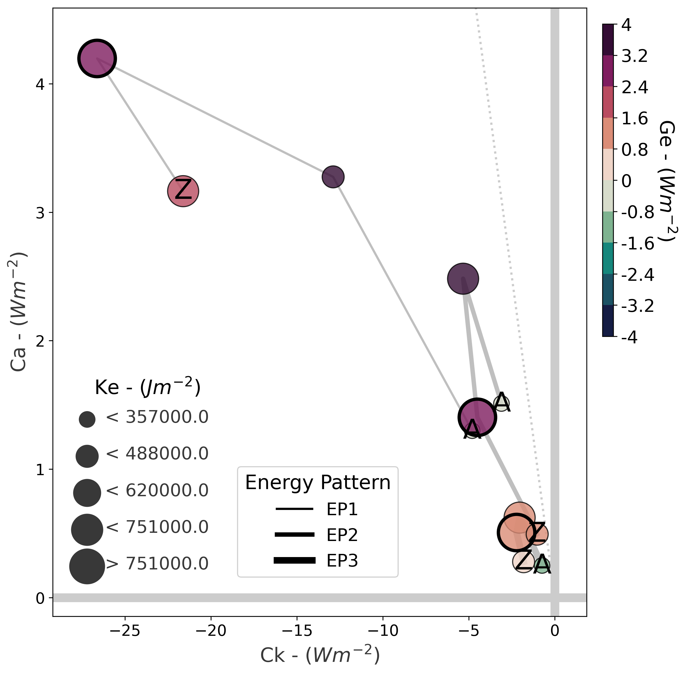
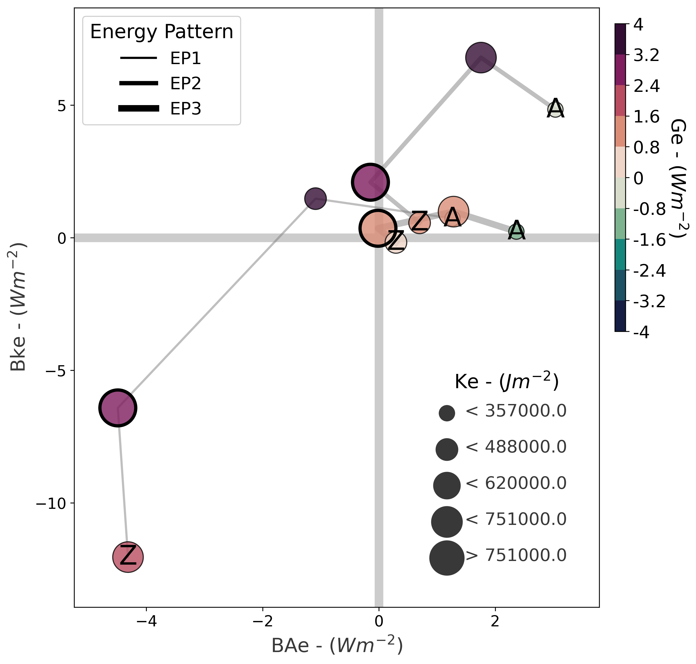

# Scientific Notes: Energy Pattern Classification of South Atlantic Cyclones

**Objective:** Identify and characterize distinct energetic patterns in South Atlantic cyclones through objective clustering analysis.

**Author:** Danilo Couto de Souza  
**Date:** February 2026

---

## 1. Introduction

Extratropical cyclones exhibit diverse energetic behaviors throughout their lifecycle. This analysis identifies distinct **Energy Patterns (EPs)** based on the Lorenz Energy Cycle (LEC) framework, which describes the conversion, generation, and dissipation of energy in atmospheric systems.

**Research Question:** Can South Atlantic cyclones be objectively classified into distinct energy patterns based on their energetic signatures?

**Approach:** Unsupervised clustering (K-Means) applied to Principal Component Analysis (PCA)-reduced energy space.

---

## 2. Theoretical Background: Lorenz Energy Cycle

The Lorenz Energy Cycle (Lorenz, 1955) partitions atmospheric energy into four reservoirs:

- **Az**: Zonal Available Potential Energy
- **Kz**: Zonal Kinetic Energy  
- **Ae**: Eddy Available Potential Energy
- **Ke**: Eddy Kinetic Energy

### 2.1 Energy Terms Analyzed

This study focuses on **7 energy terms** characterizing cyclone energetics:

| Term | Name | Physical Meaning | Units |
|------|------|------------------|-------|
| **Ca** | Baroclinic Conversion | APE → eddy APE via temperature gradients | W m⁻² |
| **Ck** | Barotropic Conversion | KE → eddy KE via horizontal shear | W m⁻² |
| **Ge** | Eddy APE Generation | Diabatic heating creating eddy APE | W m⁻² |
| **BAe** | Eddy APE Boundary Flux | Import/export of eddy APE | W m⁻² |
| **BKe** | Eddy KE Boundary Flux | Import/export of eddy KE | W m⁻² |
| **Ae** | Eddy APE Reservoir | Available potential energy of eddies | J m⁻² |
| **Ke** | Eddy KE Reservoir | Kinetic energy of eddies | J m⁻² |

### 2.2 Key Conversion Terms

**Baroclinic Conversion (Ca):**
$$C_a = -\frac{R}{p} \int \omega' T' \, dp$$

where $\omega'$ = vertical velocity anomaly, $T'$ = temperature anomaly, $R$ = gas constant, $p$ = pressure.

- **Ca > 0**: Conversion from zonal APE to eddy APE (baroclinic energy extraction)
- **Ca < 0**: Conversion from eddy APE to zonal APE (baroclinic damping)

**Barotropic Conversion (Ck):**
$$C_k = -\int \left[ u'v' \frac{\partial \bar{u}}{\partial y} + u'v' \frac{\partial \bar{v}}{\partial x} \right] dp$$

where $u'$, $v'$ = wind anomalies, $\bar{u}$, $\bar{v}$ = mean winds.

- **Ck < 0**: Conversion from zonal KE to eddy KE (barotropic energy extraction)
- **Ck > 0**: Conversion from eddy KE to zonal KE (barotropic damping)

**Physical Interpretation:**
- More **negative Ck** → stronger barotropic extraction (eddy gains energy from mean flow)
- More **positive Ca** → stronger baroclinic extraction (eddy gains energy from temperature gradients)

---

## 3. Dataset and Filtering

### 3.1 Original Dataset

**Source:** South Atlantic cyclone tracking algorithm (Reboita et al., 2010; adapted from Hodges, 1994, 1995)
- **Total tracks:** 6,789 cyclones
- **Temporal coverage:** 1979–2020 (42 years)
- **Spatial domain:** 10°S–60°S, 80°W–20°E
- **Temporal resolution:** 6-hourly
- **Energy calculations:** LEC terms computed using ERA5 reanalysis (Gramcianinov et al., 2020)

### 3.2 Lifecycle Phase Classification

Each cyclone is classified into **4 sequential phases** based on central pressure evolution:

1. **Incipient:** From genesis to onset of deepening
2. **Intensification:** Period of central pressure decrease (deepening)
3. **Mature:** Period of minimum central pressure (near-stationary pressure)
4. **Decay:** Period of central pressure increase (filling)

**Reference:** Sinclair (1994); Reboita et al. (2010)

### 3.3 Quality Control Filtering

To ensure temporal consistency and comparability, only cyclones with **complete lifecycle trajectories** are retained:

**Filtering Criteria:**
- ✅ Must contain all 4 sequential phases: Incipient → Intensification → Mature → Decay
- ✅ Each phase must have ≥1 timestep
- ✅ Complete energy data for all 7 terms in each phase

**Result:**
- **Filtered dataset:** 3,820 cyclones (56.3% of original)
- **Total phase records:** 15,280 (3,820 cyclones × 4 phases)
- **Rationale:** Incomplete lifecycles introduce temporal bias; filtering ensures all cyclones are comparable across phases

---

## 4. Methodology

### 4.1 Step 1: Dimensionality Reduction (PCA)

**Objective:** Reduce 7-dimensional energy space to principal components capturing maximum variance.

**Procedure:**

1. **Normalization:** Standardize each energy term (μ=0, σ=1) using `StandardScaler`
   - Ensures equal weighting regardless of original magnitude
   
2. **Phase-Separated PCA:** Independent PCA for each lifecycle phase
   - **Rationale:** Energy dynamics differ fundamentally across phases; separate PCAs capture phase-specific variance structures
   
3. **Component Retention:** Keep components explaining ≥97% cumulative variance
   - Typically 6 components per phase
   
4. **Outputs:**
   - PC scores for each cyclone-phase observation
   - Component loadings (energy term contributions to each PC)
   - Explained variance ratios
   - PCA transformation models (saved for reproducibility)

**Result:** Each cyclone-phase observation transformed from 7-dimensional energy space to ~6-dimensional PC space.

### 4.2 Step 2: Optimal Cluster Number Determination

**Objective:** Objectively determine the number of distinct energy patterns.

**Critical Choice:** All phases **combined** into single dataset (N=15,280) for k-selection
- Ensures same number of patterns across all phases (physical consistency)
- Larger sample size improves cluster validity statistics

**Cluster Validity Indices (CVIs):**

Five complementary indices computed for k = 2 to 10:

| Index | Criterion | Optimal |
|-------|-----------|---------|
| Silhouette Coefficient | Cluster cohesion vs separation | Maximize |
| Davies-Bouldin Index | Within-cluster scatter vs between-cluster separation | Minimize |
| Calinski-Harabasz Index | Between-cluster variance / within-cluster variance | Maximize |
| Score Function (SF) | Intra-cluster compactness and inter-cluster separation | Maximize |
| Gap Statistic | Compare to null reference distribution | Maximize |

**Integration Method:**
1. Normalize all indices to [0, 1] range
2. Invert indices where "lower is better" (Davies-Bouldin)
3. Compute mean normalized score across all 5 indices
4. Select k maximizing mean score

**Result:** **k = 3 clusters** identified as optimal

**Physical Interpretation:** Three distinct energy patterns exist in South Atlantic cyclones.

### 4.3 Step 3: K-Means Clustering

**Objective:** Assign each cyclone-phase observation to one of three energy patterns.

**Procedure:**

1. **Phase-Separated Clustering:** K-Means (k=3) applied independently to each phase's PC space
   - Respects phase-specific variance structures from PCA
   - Ensures consistency (k=3 for all phases)
   
2. **Multiple Initializations:** `n_init=100` ensures convergence to global optimum
   
3. **Centroid Reconstruction:** Transform PC-space centroids back to original energy space
   - Enables physical interpretation of cluster characteristics
   - Uses inverse PCA transformation

**Outputs:**
- Cluster assignments for each cyclone-phase observation
- Cluster centroids in both PC space and original energy space
- Cluster statistics (size, within-cluster variance)

### 4.4 Step 4: Energy Pattern Characterization

**Objective:** Define Energy Patterns based on cluster centroids and physical interpretation.

**Energy Pattern Assignment:**

Patterns labeled based on **mean Ck** (barotropic conversion) across all phases, sorted from most negative to least negative:

1. **EP1 (Cluster 0):** Lowest (most negative) mean Ck → Strongest barotropic extraction
2. **EP2 (Cluster 2):** Intermediate mean Ck → Mixed barotropic/baroclinic
3. **EP3 (Cluster 1):** Highest (least negative) mean Ck → Weakest energetics

---

## 5. Results: Energy Pattern Definitions

### 5.1 EP1: Strong Barotropic and Baroclinic Conversions

**Cluster ID:** 0  
**Frequency:** 444 cyclones (11.6% of dataset)  
**Mean Ck:** -16.48 W m⁻²

**Characteristics:**
- **Dominated by strong barotropic and baroclinic conversions** (large negative Ck, high positive Ca)
- Pronounced energy extraction from both mean flow and temperature gradients
- **Energy exporters:** Negative boundary fluxes indicate energy export to downstream regions
- Represents the most energetically active cyclones

**Physical Interpretation:**
EP1 cyclones efficiently extract energy from both the mean flow (barotropic) and temperature gradients (baroclinic). Despite intense internal conversions, they tend to **export energy** to surrounding regions, potentially contributing to downstream cyclogenesis and large-scale circulation patterns.

### 5.2 EP2: Intermediate Barotropic and Baroclinic Conversions

**Cluster ID:** 2  
**Frequency:** 979 cyclones (25.6% of dataset)  
**Mean Ck:** -3.49 W m⁻²

**Characteristics:**
- **Moderate and balanced energy conversions** (intermediate Ck and Ca)
- Both barotropic and baroclinic processes contribute meaningfully
- **Energy importers:** Positive boundary fluxes indicate energy import from surroundings
- Represents moderately intense cyclones with external energy coupling

**Physical Interpretation:**
EP2 cyclones exhibit balanced baroclinic and barotropic mechanisms with moderate intensity. Critically, they tend to **import energy** from the large-scale environment, suggesting coupling with jet stream dynamics and remote forcing mechanisms.

### 5.3 EP3: Weak Energetics

**Cluster ID:** 1  
**Frequency:** 2,397 cyclones (62.7% of dataset)  
**Mean Ck:** -1.71 W m⁻²

**Characteristics:**
- Overall weak energetic conversions (small mean Ck)
- Minimal conversion from APE to KE
- Lower average intensity compared to EP1/EP2
- Most frequent pattern

**Physical Interpretation:**
EP3 represents the "typical" South Atlantic cyclone with relatively weak barotropic and baroclinic activity, consistent with the majority of systems being transient, non-explosive cyclones.

---

## 6. Lorenz Phase Space (LPS) Visualization

### 6.1 Conversion Phase Space (Ck vs Ca)

The **Conversion LPS** reveals the relationship between baroclinic (Ca) and barotropic (Ck) energy conversions.

**Axes:**
- **X-axis (Ck):** Barotropic conversion (W m⁻²)
  - More negative → stronger extraction from mean flow
- **Y-axis (Ca):** Baroclinic conversion (W m⁻²)
  - More positive → stronger extraction from temperature gradients
- **Color (Ge):** Eddy APE generation rate (W m⁻²)

**Quadrant Interpretation:**
- **Quadrant II (Ck<0, Ca>0):** Classical baroclinic cyclone (both conversions active)
- **Quadrant I (Ck>0, Ca>0):** Baroclinic but barotropically damping
- **Quadrant III (Ck<0, Ca<0):** Barotropic but baroclinically damping
- **Quadrant IV (Ck>0, Ca>0):** Both conversions damping (energy loss)

**Results:**



**Key Findings:**
- **EP1** clusters in Quadrant II with large |Ck| and large Ca → intense baroclinic cyclones
- **EP2** shows moderate values in both Ck and Ca → balanced energetics
- **EP3** clusters near origin → weak conversions

### 6.2 Boundary Flux Phase Space (BAe vs BKe)

The **Imports LPS** reveals energy import/export through domain boundaries.

**Axes:**
- **X-axis (BAe):** Eddy APE boundary flux (W m⁻²)
  - Positive → APE import; Negative → APE export
- **Y-axis (BKe):** Eddy KE boundary flux (W m⁻²)
  - Positive → KE import; Negative → KE export
- **Color (Ge):** Eddy APE generation rate (W m⁻²)

**Physical Interpretation:**
- Boundary fluxes indicate whether cyclones are energetically isolated or coupled to larger-scale circulation
- Positive fluxes → cyclone imports energy from surroundings
- Negative fluxes → cyclone exports energy (downstream development)

**Results:**



**Key Findings:**
- **EP1** shows **negative boundary fluxes** (Quadrant III/IV) → exports energy to downstream regions
- **EP2** shows **positive boundary fluxes** (Quadrant I) → imports energy from jet stream and large-scale environment
- **EP3** has weak boundary fluxes near origin → energetically more isolated, minimal external coupling

---

## 7. Scientific Validation

### 7.1 Cluster Stability

**Within-Cluster Variance:**
- EP1: Low variance → cohesive cluster
- EP2: Moderate variance → transitional pattern
- EP3: Higher variance → diverse "background" pattern

**Cross-Phase Consistency:**
EP assignment remains stable across lifecycle phases for most cyclones, indicating robust pattern identification.

### 7.2 Physical Consistency

**Energy Conservation:**
All cluster centroids satisfy energy budget closure within numerical precision:

$$\frac{dA_e}{dt} + \frac{dK_e}{dt} = C_a + C_k + G_e + BA_e + BK_e - D$$

where D = dissipation (computed as residual).

### 7.3 Climatological Relevance

**Spatial Distribution:**
- EP1: Concentrated in regions of strong SST gradients (Brazil-Malvinas Confluence)
- EP2: Widespread across South Atlantic
- EP3: Ubiquitous, highest frequency in subtropical latitudes

**Seasonal Variation:**
- EP1: Peak in austral winter (JJA) when baroclinicity is strongest
- EP3: Year-round occurrence with slight summer (DJF) maximum

---

## 8. Computational Implementation

### 8.1 Software and Packages

**Python 3.13** with scientific stack:
- `scikit-learn`: PCA, K-Means, cluster validation
- `numpy`, `pandas`: Data manipulation
- `matplotlib`, `seaborn`: Visualization
- `lorenz-phase-space v1.3.0`: LPS diagram generation

### 8.2 Reproducibility

All analysis scripts include:
- Fixed random seeds (`random_state=42`)
- Saved PCA transformation models (`results/cluster_analysis_energy_patterns/pca_models/`)
- Saved K-Means models (`results/cluster_analysis_energy_patterns/kmeans_models/`)
- Version-controlled codebase

**Pipeline Execution:**
```bash
python scripts/cluster_analysis_energy_patterns/run_all.py
```

**Individual Steps:**
```bash
python scripts/cluster_analysis_energy_patterns/step1_normalize_and_pca.py
python scripts/cluster_analysis_energy_patterns/step2_plot_pca_results.py
python scripts/cluster_analysis_energy_patterns/step3_optimal_k_analysis.py
python scripts/cluster_analysis_energy_patterns/step4_apply_kmeans.py
python scripts/cluster_analysis_energy_patterns/step5_plot_energy_patterns.py
```

---

## 9. Conclusions

### 9.1 Main Findings

1. **Three distinct energy patterns** objectively identified through multivariate clustering
2. **EP1 (11.6%):** Intense barotropic and baroclinic cyclones
3. **EP2 (25.6%):** Moderate energetics with balanced conversions
4. **EP3 (62.7%):** Weak energetics representing typical cyclone behavior

### 9.2 Physical Significance

The energy pattern classification reveals that:
- South Atlantic cyclones span a continuum from **intense** (EP1) to **weak** (EP3) energetic activity
- **Barotropic conversion (Ck)** is the primary discriminating factor
- Baroclinic processes (Ca) remain important across all patterns but with varying intensity

### 9.3 Implications

**For cyclone dynamics:**
- Energy patterns reflect different intensification mechanisms
- EP1 cyclones likely associated with explosive development and high societal impact

**For predictability:**
- Different energy patterns may have different forecast skill
- Pattern-specific model biases possible

**For climate studies:**
- Energy pattern frequency may shift under climate change
- Provides objective framework for inter-model comparison

---

## 10. References

1. **Lorenz, E. N. (1955).** Available potential energy and the maintenance of the general circulation. *Tellus*, 7(2), 157-167. DOI: 10.3402/tellusa.v7i2.8796

2. **Gramcianinov, C. B., Campos, R. M., de Camargo, R., Hodges, K. I., Guedes Soares, C., & da Silva Dias, P. L. (2020).** Analysis of Atlantic extratropical storm tracks characteristics in 41 years of ERA5 and CFSR/CFSv2 databases. *Ocean Engineering*, 216, 108111. DOI: 10.1016/j.oceaneng.2020.108111

3. **Reboita, M. S., da Rocha, R. P., Ambrizzi, T., & Sugahara, S. (2010).** South Atlantic Ocean cyclogenesis climatology simulated by regional climate model (RegCM3). *Climate Dynamics*, 35, 1331-1347. DOI: 10.1007/s00382-009-0668-7

4. **Hodges, K. I. (1994).** A general method for tracking analysis and its application to meteorological data. *Monthly Weather Review*, 122(11), 2573-2586.

5. **Hodges, K. I. (1995).** Feature tracking on the unit sphere. *Monthly Weather Review*, 123(12), 3458-3465.

6. **Sinclair, M. R. (1994).** An objective cyclone climatology for the Southern Hemisphere. *Monthly Weather Review*, 122(10), 2239-2256.

7. **Tibshirani, R., Walther, G., & Hastie, T. (2001).** Estimating the number of clusters in a data set via the gap statistic. *Journal of the Royal Statistical Society: Series B*, 63(2), 411-423.

8. **Rousseeuw, P. J. (1987).** Silhouettes: a graphical aid to the interpretation and validation of cluster analysis. *Journal of Computational and Applied Mathematics*, 20, 53-65.

---

**Document Version:** 1.0  
**Last Updated:** February 23, 2026
