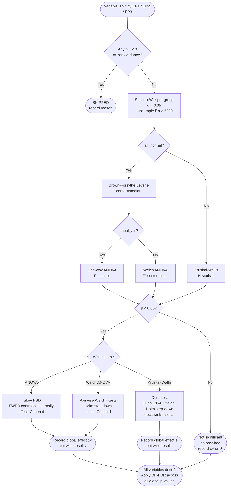

# SCIENTIFIC NOTES — LEC–Field Dependence Analysis

---

## Research Questions

1. **How much do the spatial features of the atmospheric dynamical fields predict the energetic behaviour of individual South Atlantic extratropical cyclones?**

2. **Does the predictive relationship between dynamical structure and energetics differ across Energy Patterns (EP1, EP2, EP3)?**

3. **Are there specific spatial features (e.g., zonal contrast, southern border mean) of specific fields (e.g., PV at 200 hPa, AFC at 250 hPa) that are particularly informative about specific LEC terms (e.g., baroclinic conversion Ca, barotropic conversion Ck)?**

4. **Does the use of EPALL-relative anomaly fields (isolating EP-specific structure) lead to stronger or weaker predictive associations compared to absolute fields?**

5. **For each scalar variable (LEC term or dynamic feature), do EP1, EP2, and EP3 differ significantly?  Which pairs differ, and how large is the effect?**

---

## Physical / Statistical Framework

### Motivation

The Energy Pattern classification (EP1, EP2, EP3) was derived from PCA-based K-Means clustering on Lorenz Energy Cycle diagnostics during the intensification phase of South Atlantic extratropical cyclones. The subsequent composite analysis (ep_structure_analysis) revealed distinct atmospheric structures for each EP using ERA5 fields.

However, the composite analysis operates on **group means** — it shows what the "average" EP1, EP2, or EP3 cyclone looks like, but does not capture the **individual-level relationship** between a cyclone's energetics and its atmospheric structure. This analysis bridges that gap.

### Association Metrics

#### Spearman Rank Correlation as the Primary Interpretive Metric

Spearman's rank correlation coefficient (ρ) is adopted as the primary metric for identifying and prioritising physically interpretable LEC–field associations in this analysis. Being a monotone rank measure, Spearman ρ is robust to the non-Gaussian distributions typical of LEC diagnostics (conversion terms, boundary fluxes) and dynamic field features (PV, AFC). It directly quantifies the direction and strength of monotonic associations in a way that is immediately interpretable and well-established in the atmospheric sciences literature, enabling straightforward ranking of LEC–feature pairs.

Pearson r is computed alongside Spearman ρ as a complementary linear-association measure. Divergence between Pearson and Spearman for the same pair is itself informative: it indicates non-linear (though still monotonic) structure in the association.

Spearman and Pearson correlation heatmaps for all EP × LEC term × field–feature combinations are produced by `scripts/lec_field_dependence_analysis/diag_correlation_heatmaps.py` and saved to `figures/lec_field_dependence/diagnostics/correlation_heatmaps/`. These are the primary exploratory figures for assessing LEC–field associations.

#### PREDEP as a Complementary Dependence Diagnostic

We retain the PREDEP measure (Assunção et al. 2025, arXiv:2501.10815) as a complementary, non-parametric dependence diagnostic. PREDEP is a fully non-parametric measure of predictive dependence between continuous random variables.

**Formal definition:**

$$\alpha_{Y|X} = \frac{S_{Y|X} - S_Y}{S_{Y|X}}$$

where:
- $S_Y = \mathbb{E}[f_Y(Y)] = \int f_Y^2(y)\,dy$ is the marginal prediction rate (linked to the quadratic Rényi entropy)
- $S_{Y|X} = \mathbb{E}_X[\mathbb{E}_{Y|X} f_{Y|X}(Y|X)]$ is the conditional prediction rate
- $\alpha \in [0, 1]$
- $\alpha = 0 \iff X \perp Y$ (independence)
- $\alpha = 1$ means Y is perfectly predictable from X

**Direction convention in this analysis:**

The primary direction is:

$$\alpha_{\text{LEC term} | \text{feature}} \quad \text{where} \quad X = \text{feature},\; Y = \text{LEC term}$$

This answers: *"by what fraction does knowing the dynamic feature reduce the prediction loss of the LEC term?"*

For example, $\alpha_{Ca | \text{domain\_mean(PV\_200)}} = 0.35$ means that knowing the domain-mean PV at 200 hPa reduces the prediction error of baroclinic conversion ($C_a$) by 35%.

**PREDEP is asymmetric:** $\alpha_{Y|X} \neq \alpha_{X|Y}$ in general. This is a feature, not a bug — it correctly reflects that predicting Y from X is not the same as predicting X from Y.

### Rationale for Spearman-First Framing

Spearman ρ is adopted as the primary interpretive metric because it is more discriminative for prioritising physically interpretable associations in this dataset. An initial full-pipeline run revealed that PREDEP values were broadly elevated across most LEC–field variable pairs (α ≈ 0.40–0.70, with a persistent floor near 0.40), limiting PREDEP's usefulness for ranking associations by strength. This is physically plausible: PREDEP captures any form of predictive dependence — including non-functional and non-monotonic relationships. Because LEC terms and dynamic field features both reflect the same underlying cyclone structure, inter-variable independence is inherently constrained across the full matrix, leading to broadly elevated PREDEP values that reduce its discriminative power relative to Spearman ρ.

PREDEP was retained as a complementary dependence diagnostic, not discarded. Its particular value lies in detecting associations that have structured dependence but no clear monotonic form — cases where Spearman ρ is near zero but PREDEP remains elevated. A combination of high Spearman ρ and high PREDEP provides the strongest evidence for a physically robust association; variables where only PREDEP is elevated may reflect non-monotonic structure deserving separate investigation.

Regarding Pearson r: it measures strictly linear association and is sensitive to outliers, which are common in LEC boundary flux terms. It is computed as a cross-check rather than a primary ranking metric. Divergence between Pearson r and Spearman ρ for the same pair is informative about distributional features of the data.

---

## Datasets and Variables

### LEC Terms

Source: LEC results from Zenodo (DOI: 10.5281/zenodo.18243447), 3-hourly time series with 32 vertical levels.

For this analysis, we use the **intensification-phase mean** of each term:

| Term | Description | Units |
|------|-------------|-------|
| $A_z$ | Zonal available potential energy | W m⁻² |
| $A_e$ | Eddy available potential energy | W m⁻² |
| $K_z$ | Zonal kinetic energy | W m⁻² |
| $K_e$ | Eddy kinetic energy | W m⁻² |
| $C_z$ | Zonal APE → Zonal KE conversion | W m⁻² |
| $C_a$ | Zonal APE → Eddy APE conversion (baroclinic) | W m⁻² |
| $C_k$ | Eddy KE → Zonal KE conversion (barotropic) | W m⁻² |
| $C_e$ | Eddy APE → Eddy KE conversion | W m⁻² |
| $BA_z, BA_e$ | Boundary APE fluxes (zonal, eddy) | W m⁻² |
| $BK_z, BK_e$ | Boundary KE fluxes (zonal, eddy) | W m⁻² |
| $B\Phi_Z, B\Phi_E$ | Boundary pressure work fluxes | W m⁻² |
| $G_z, G_e$ | Generation of APE (zonal, eddy) | W m⁻² |
| Residuals | $RG_z, RK_z, RG_e, RK_e$ | W m⁻² |
| Tendencies | $\partial A_z/\partial t$, $\partial A_e/\partial t$, $\partial K_z/\partial t$, $\partial K_e/\partial t$ | W m⁻² |

All 24 terms are loaded.  Two term sets are used in the analysis:

- **Canonical 7 terms** (`LEC_TERMS_CORE`): `Ca`, `Ck`, `BAe`, `BKe`, `Ae`, `Ke`, `Ge` — the exact set used in the PCA-based K-Means EP classification.  These are the primary analysis terms (figures in `figures/lec_field_dependence/canonical/`).
- **All 24 terms** (exploratory): used for completeness and internal validation (`figures/lec_field_dependence/all/`).

**Note on term alignment**: `Ce`, `Cz`, `Gz` were present in `LEC_TERMS_CORE` in an earlier version of the pipeline but were never part of the clustering step.  They have been removed from `LEC_TERMS_CORE` (corrected 2025-04-19) to ensure canonical analysis is consistent with the EP classification.

### Dynamic Fields

Source: ERA5 reanalysis, 0.25° resolution, storm-centred 30°×30° domain.

| Field | Variable | Level | Physical Meaning |
|-------|----------|-------|-----------------|
| PV (low-level) | `pv_850` | 850 hPa | Diabatic PV anomaly, low-level forcing |
| PV (upper-level) | `pv_200` | 200 hPa | Tropopause dynamics, upper-level forcing |
| Temperature advection | `adv_T_850` | 850 hPa | Warm/cold advection structure |
| AFC | `afc_250` | 250 hPa | Ageostrophic flux convergence (eddy KE redistribution) |
| KE advection | `ke_adv_250` | 250 hPa | Jet-level kinetic energy tendency |

**Derivation (step 3b):** The raw per-cyclone ERA5 files contain instantaneous pressure-level fields (`u`, `v`, `t`, `z`, `q`) downloaded from the CDS API. The dynamic diagnostics listed above are NOT present in the raw files. They are computed in pipeline **step 3b** (`step3b_derive_era5_fields.py`) using the validated diagnostic functions from `scripts/ep_structure_analysis/step3_precompute_composites.py`, ensuring methodological consistency between this analysis and the ep_structure composites. Derived fields are saved to `{derived_dir}/{track_id}_era5_derived.nc` (raw files are never modified). Steps 4 and 5 read exclusively from the derived files.

Diagnostic formulas (consistent with ep_structure_analysis):

- **PV at 850/200 hPa**: Ertel potential vorticity $q = -g\left(\frac{\partial\theta}{\partial p}\right)\zeta_a$ computed via MetPy using 3-level centred finite differences on `h-1`, `h`, `h+1` pressure levels.
- **Temperature advection at 850 hPa**: $-\mathbf{V} \cdot \nabla T$ via MetPy advection with spherical-geometry gradients.
- **KE advection at 250 hPa**: $-\mathbf{V} \cdot \nabla\left(\frac{1}{2}|\mathbf{V}|^2\right)$ via MetPy advection.
- **AFC at 250 hPa**: Ageostrophic flux convergence following Orlanski & Katzfey (1991): $-\nabla \cdot (\mathbf{V}_a K)$ where $\mathbf{V}_a$ is the ageostrophic wind and $K$ is kinetic energy anomaly relative to the ERA5 climatological mean at 250 hPa.

Two versions of each field:
1. **Absolute**: the field as derived for the cyclone
2. **EPALL-relative anomaly**: cyclone field − EPALL composite mean (isolates what is distinctive about each cyclone relative to the average cyclone)

### Temporal Representation

LEC temporal averaging follows the canonical `ep_structure_analysis` methodology, selecting the **central timesteps** of the intensification phase:

| Intensification length (N) | Timesteps selected | Rationale |
|---|---|---|
| Odd N (e.g. 5) | 3 central: `[N//2−1, N//2, N//2+1]` | Symmetric window around midpoint |
| Even N (e.g. 4) | 2 central: `[N//2−1, N//2]` | Balanced pair around midpoint |
| N ≤ 3 | All timesteps | Too short for sub-selection |

Only cyclones with intensification duration > 24 h (N > 8 at 3-hourly resolution) are included.

**ERA5 fields**: single central timestep of the intensification phase (canonical ep_structure methodology; snapshot at cyclone mature stage).

**Temporal consistency**: Both the LEC values and the ERA5 fields are centred on the same portion of the intensification phase, eliminating the temporal mismatch that would arise from averaging LEC over the entire phase.

---

## Methodology

### Feature Extraction

Each 2D storm-centred field is summarised into 13 scalar features computed on the inner 15°×15° box centred on the cyclone:

| Feature | Definition |
|---------|-----------|
| domain_mean | $\bar{f} = \frac{1}{N}\sum_i f_i$ (mean over inner box) |
| centre_value | $f(x_c, y_c)$ (value at cyclone centre) |
| border_north | Mean of northern 5-cell strip |
| border_south | Mean of southern 5-cell strip |
| border_east | Mean of eastern 5-cell strip |
| border_west | Mean of western 5-cell strip |
| contrast_ew | $\bar{f}_E - \bar{f}_W$ (zonal asymmetry) |
| contrast_sn | $\bar{f}_S - \bar{f}_N$ (meridional asymmetry) |
| sector_north | Mean over the northern half of the inner box |
| sector_south | Mean over the southern half of the inner box |
| sector_east | Mean over the eastern half of the inner box |
| sector_west | Mean over the western half of the inner box |
| domain_abs_mean | $\frac{1}{N}\sum_i |f_i|$ (mean absolute value) |

**Rationale for feature choices:**

- `domain_mean`: overall field intensity in the cyclone vicinity
- `centre_value`: field intensity at the cyclone core
- Border means (5-cell strip): sharp spatial structure on each side
- Contrasts: capture baroclinic tilt (E-W) and frontal structure (S-N)
- Sector means: cardinal-hemisphere structure (North/South/East/West halves).  Preferred over diagonal quadrants (NE/NW/SE/SW) because the LEC framework captures zonal and meridional energy contrasts, not diagonal ones.
- `domain_abs_mean`: important for signed fields where sign cancellation masks overall intensity

**Notes on potential redundancy:**
- `domain_mean` equals the unweighted mean of all four sector means — mathematically dependent but not statistically redundant (sectors can differ even when the mean is the same)
- If sector means are all similar, contrasts will be near zero — this is informative, not redundant
- `domain_abs_mean` adds value mainly for temperature advection and AFC where sign patterns are physically meaningful

**Note on sector vs. quadrant design (updated 2025):** Earlier versions of the pipeline used diagonal quadrant means (`quadrant_ne`, `quadrant_nw`, `quadrant_se`, `quadrant_sw`).  These were replaced with cardinal sector means (`sector_north`, `sector_south`, `sector_east`, `sector_west`) because:
(a) The LEC describes zonal and meridional energy exchanges, not diagonal ones.
(b) Cardinal sectors are aligned with the physical axes of the Coriolis effect, frontal orientation, and the LEC reference frame.
(c) Sectors integrate over larger areas (half of the inner box vs. a quarter), reducing sampling noise.
All pipeline outputs (step 4 onward) from the current run use sector features.

### PREDEP Estimation

Following the bootstrap estimator in Assunção et al. (2025):

1. $S_Y$ is estimated via the convolution-density-at-zero trick: $S_Y = \hat{f}_W(0)$ where $W = Y_1 - Y_2$
2. $S_{Y|X}$ uses hierarchical clustering (Ward linkage) on X to define bins, then applies the same bootstrap within each bin
3. Number of bins: $k = \lfloor\sqrt{N}\rfloor$
4. Number of bootstrap pairs: $n_b = \lceil N \log N \rceil$
5. KDE bandwidth: Scott's rule

### Analysis Structure

For each **EP × LEC term × field × feature** combination:
1. Select the EP subsample
2. Extract x = feature values, y = LEC term values
3. Remove paired NaN
4. Check minimum sample size (N ≥ 30)
5. Compute Spearman ρ and Pearson r (primary association metrics)
6. Compute PREDEP α_{Y|X} (complementary non-parametric dependence diagnostic)

Total combinations: 3 EPs × ~24 LEC terms × 5 fields × 13 features × 2 field types = **~9,360 PREDEP estimates**

### Inter-EP Statistical Significance Testing (Step 7b)

Independently from the PREDEP analysis, every scalar variable in the pipeline is tested for statistically significant differences between EP1, EP2, and EP3.  This concerns both the LEC terms themselves and each derived dynamic feature.

#### Rationale

The PREDEP analysis answers *"how much does a dynamic feature predict an LEC term within an EP?"*.  The significance analysis answers a complementary question: *"do EP1, EP2, and EP3 actually differ on this variable?"*.  A variable for which EPs do not differ is unlikely to be useful for discriminating energetic patterns, regardless of its PREDEP value.

#### Decision Tree

For each variable separately:

1. **Data preparation**
   - Split values by EP (EP1, EP2, EP3) — three independent groups.
   - Remove NaN / non-finite values.
   - Record per-group $n$.
   - Check degeneracy: skip if any group has $n < 8$ or zero variance.

2. **Normality assessment** — Shapiro-Wilk test per group ($\alpha = 0.05$).
   - For $n > 5000$, a random subsample of 5000 is used.  The result is flagged: at large $n$, Shapiro-Wilk over-rejects and minor non-normality is detected even when practically irrelevant.  This is a known limitation (Razali & Wah 2011).
   - **Caveat**: with EP3 having $N \approx 1600$ and EP2 $\approx 770$, the test is appropriately sensitive but still powerful enough to reject for modest departures. Results are logged in an auditable table (Shapiro statistic and $p$-value per group).

3. **Homogeneity of variances** — Levene's test with `center='median'` (Brown-Forsythe variant), which is more robust to non-normality than the mean-based version.

4. **Global test selection**:

   | Condition | Test | Justification |
   |-----------|------|---------------|
   | All groups normal + equal variances | **One-way ANOVA** | Classical F-test; assumptions met |
   | All groups normal + unequal variances | **Welch ANOVA** (Welch 1951) | Does not assume equal variances; uses weight $w_i = n_i / s_i^2$ |
   | At least one group non-normal | **Kruskal-Wallis** | Rank-based; no distributional assumption |

   The Welch ANOVA is implemented from scratch (see `utils_statistical_tests.py`) as `pingouin` is not available in the environment.

5. **Post-hoc pairwise tests** (only if global test is significant):

   | After | Post-hoc | Correction | Notes |
   |-------|----------|------------|-------|
   | One-way ANOVA | **Tukey HSD** | Inherent FWER control | `scipy.stats.tukey_hsd` |
   | Welch ANOVA | **Pairwise Welch t-tests** | Holm step-down | Used because Games-Howell requires `pingouin`.  Holm correction guarantees FWER ≤ $\alpha$. |
   | Kruskal-Wallis | **Dunn test** | Holm step-down | Implemented from Dunn (1964) with tie adjustment; `scikit_posthocs` not available. |

   **On Games-Howell**: The Games-Howell test is the canonical choice after Welch ANOVA in unbalanced designs.  It uses the Studentized Range distribution with Welch-Satterthwaite degrees of freedom.  In the absence of the `pingouin` library, pairwise Welch t-tests with Holm correction provide equivalent protection against Type I error and are widely accepted (e.g., Ruxton & Beauchamp 2008).

   **On Dunn's test**: Dunn (1964) is the standard non-parametric post-hoc for Kruskal-Wallis.  It compares mean ranks between pairs with a $z$-statistic:

   $$z_{ij} = \frac{\bar{R}_i - \bar{R}_j}{\sigma_{ij}} \quad \text{where} \quad \sigma_{ij} = \sqrt{\left[\frac{N(N+1)}{12} - \frac{\sum_t (t^3 - t)}{12(N-1)}\right] \left(\frac{1}{n_i} + \frac{1}{n_j}\right)}$$

   and the tie-correction term accounts for rank ties.

6. **Multiple comparison correction** — applied at two levels:

   a. **Within-variable pairwise**: Holm step-down (applied inside Welch t-test and Dunn procedures).  Tukey HSD controls FWER internally.

   b. **Across all variables**: Benjamini-Hochberg FDR correction applied to the global test $p$-values across all variables tested.  This is the recommended approach when testing dozens to hundreds of variables in an exploratory setting (Benjamini & Hochberg 1995).  Holm correction is available as a more conservative alternative.

7. **Effect size** — reported alongside every $p$-value to prevent over-reliance on statistical significance:

   | Context | Measure | Interpretation |
   |---------|---------|----------------|
   | ANOVA / Welch ANOVA (global) | $\omega^2$ | Less biased than $\eta^2$; proportion of variance explained.  Small: 0.01, Medium: 0.06, Large: 0.14 |
   | Kruskal-Wallis (global) | $\varepsilon^2 = (H - k + 1)/(N - k)$ | Non-parametric analogue; same interpretation thresholds as $\omega^2$ |
   | Parametric pairwise | Cohen's $d$ | Standardised mean difference.  Small: 0.20, Medium: 0.50, Large: 0.80 |
   | Non-parametric pairwise | Rank-biserial $r$ | $r = 1 - 2U/(n_1 n_2)$ from Mann-Whitney $U$.  Small: 0.10, Medium: 0.30, Large: 0.50 |

#### Interpretation Guidance

- **Do not interpret based solely on $p < 0.05$.**  At these sample sizes ($N \approx 330$ to 1600), even trivially small differences can be statistically significant.
- **Effect size is the primary interpretive quantity.**  A variable with $\omega^2 < 0.01$ is negligible regardless of $p$.
- **Use the decision tree as an audit trail**, not as a binary verdict.  The full diagnostic table logs normality results, test choices, and effect sizes for every variable.
- **Physical consistency matters.**  A statistically significant difference in $C_a$ between EP1 and EP3 is scientifically meaningful because $C_a$ is the dominant baroclinic conversion.  A significant difference in a boundary flux residual may be a statistical artefact.

#### Known Limitations of the Significance Analysis

1. **Large-sample over-rejection**: Shapiro-Wilk rejects normality for practically normal distributions when $N > 500$.  The non-parametric path (Kruskal-Wallis → Dunn) is conservative but may miss subtleties that ANOVA captures better via CLT robustness.

2. **Balanced-design assumption**: Tukey HSD assumes balanced groups.  With EP1 ($\approx$330), EP2 ($\approx$770), EP3 ($\approx$1600), designs are unbalanced by a factor of ~5.  Welch-based corrections and rank tests partly address this but interpretation should note the imbalance.

3. **Global FDR correction**: With ~150+ variables tested, the FDR correction reduces the number of discoveries.  Variables that are significant at raw $p < 0.05$ but not after FDR correction should be flagged as *suggestive but unconfirmed*.

4. **Independence assumption**: Variables (especially derived features from the same field) are correlated.  FDR correction treats them as independent tests, which is conservative in the presence of positive dependence (Benjamini & Yekutieli 2001 show FDR still controls at $q$ level under positive regression dependency).

#### Algorithmic Pseudocode

The following captures the exact logic implemented in `utils_statistical_tests.py` and `step7b_ep_significance_tests.py`.  Constants are literal values from the code.

```
CONSTANTS:
  ALPHA           = 0.05
  MIN_SAMPLE_SIZE = 8
  SHAPIRO_MAX_N   = 5000

FOR each block IN [lec_terms, absolute_features, anomaly_features]:

  FOR each variable IN block:

    # ── 1. DATA PREPARATION ───────────────────────────────────────────
    groups = split variable values by EP label  # three arrays: EP1, EP2, EP3
    FOR each group:
        remove NaN and non-finite values
        record n_i = len(group)

    # ── 2. DEGENERACY CHECK ───────────────────────────────────────────
    IF any n_i < MIN_SAMPLE_SIZE (8):
        record SKIPPED: "insufficient samples"; continue to next variable
    IF any group has zero variance (ptp == 0):
        record SKIPPED: "zero variance"; continue to next variable

    # ── 3. NORMALITY — Shapiro-Wilk per group ────────────────────────
    FOR each group:
        IF n_i > SHAPIRO_MAX_N (5000):
            subsample 5000 observations uniformly (seed=42)
            append note: "Shapiro-Wilk subsampled; over-rejection risk"
        IF n_i < 3:
            mark is_normal = False; append note: "n < 3, skipped"
        ELIF all values identical:
            mark is_normal = False; append note: "zero variance"
        ELSE:
            SW_stat, SW_p = shapiro(group)
            is_normal = (SW_p > ALPHA)  # True if p > 0.05

    all_normal = all(is_normal for each group)

    IF all groups have n > 500 AND all_normal is False:
        append advisory note: "Shapiro-Wilk overpowered; CLT likely holds;
          ANOVA is generally robust; non-parametric path used conservatively."

    # ── 4. HOMOGENEITY — Brown-Forsythe Levene ───────────────────────
    levene_stat, levene_p = levene(*groups, center='median')
    equal_var = (levene_p > ALPHA)

    # ── 5. GLOBAL TEST SELECTION ──────────────────────────────────────
    IF all_normal AND equal_var:
        global_test = one_way_ANOVA(groups)         # scipy.stats.f_oneway
        effect_size = omega_squared(groups)          # ω²
        decision_path = "Normal + homogeneous → One-way ANOVA"

    ELIF all_normal AND NOT equal_var:
        global_test = welch_ANOVA(groups)            # custom Welch 1951
        effect_size = omega_squared(groups)          # ω²
        decision_path = "Normal + heterogeneous → Welch ANOVA"
        append note: "Games-Howell unavailable (no pingouin);
          pairwise Welch t + Holm used instead."

    ELSE:  # at least one group non-normal
        global_test = kruskal_wallis(groups)         # scipy.stats.kruskal
        H = global_test.statistic
        k = 3  # number of groups
        N = sum of all n_i
        effect_size = epsilon_squared(H, N, k)       # ε² = (H−k+1)/(N−k)
        decision_path = "Non-normal → Kruskal-Wallis"

    # ── 6. POST-HOC (only if global p < ALPHA) ───────────────────────
    IF global_test.p_value < ALPHA:
        IF decision_path is ANOVA:
            pairwise = tukey_hsd(groups, labels)          # FWER controlled internally
            pairwise_effect = cohen_d(pair_i, pair_j)     # pooled SD

        ELIF decision_path is Welch ANOVA:
            FOR each pair (i, j):
                t_stat, p_raw = ttest_ind(group_i, group_j, equal_var=False)
                cohen_d = pooled_cohen_d(group_i, group_j)
            _, p_adj = holm(p_raw_values)                 # Holm step-down
            pairwise_effect = cohen_d

        ELSE:  # Kruskal-Wallis path
            # Dunn (1964) with tie adjustment:
            rank all N observations jointly (average ties)
            FOR each pair (i, j):
                z_ij = (R̄_i − R̄_j) / σ_ij
                  where σ_ij = sqrt([N(N+1)/12 − Σ(t³−t)/12(N−1)] × (1/n_i + 1/n_j))
                p_raw = 2 * norm.sf(|z_ij|)
                U, _ = mannwhitneyu(group_i, group_j)
                r_rb = 1 − 2U/(n_i × n_j)              # rank-biserial r
            _, p_adj = holm(p_raw_values)               # Holm step-down
            pairwise_effect = r_rb
    ELSE:
        pairwise = []  # post-hoc not run when global test not significant

    store diagnostic row for this variable

  END FOR (variables)

  # ── 7. GLOBAL CROSS-VARIABLE CORRECTION ──────────────────────────
  raw_p_values = [row.global_p_raw for all non-skipped rows in block]
  global_p_adjusted = benjamini_hochberg(raw_p_values)  # or Holm if --holm flag
  fill global_p_adjusted column in diagnostic table

END FOR (blocks)
```

#### Decision Flowchart



#### What was Effectively Done in Practice

**Implemented procedure.** For each scalar variable (LEC term or dynamic feature), the analysis applies the following decision tree: normality is assessed per EP group using Shapiro–Wilk (α = 0.05; groups with n > 5000 are subsampled to 5000 before testing). If all three EP groups pass normality, variance homogeneity is tested with the Brown–Forsythe–Levene test (center='median'). Homogeneous normal cases are analysed with one-way ANOVA (post-hoc: Tukey HSD); heterogeneous normal cases with Welch ANOVA (post-hoc: pairwise Welch t-tests with Holm correction). If at least one group fails normality, Kruskal–Wallis is used (post-hoc: Dunn's test with Holm correction). A global Benjamini–Hochberg FDR correction is applied across all tested variables within each analysis block.

**Empirical outcome.** The step 7b pipeline (`step7b_diagnostic_table.csv`) has not yet been executed against the canonical central-timestep outputs; the diagnostic table is not yet available to verify which statistical path was taken for each variable. However, the analytical expectation is unambiguous: with group sizes of EP1 ≈ 330, EP2 ≈ 770, and EP3 ≈ 1600, Shapiro–Wilk is highly powered and will reject normality for the majority of variables, particularly LEC terms and dynamic features that are skewed or heavy-tailed. Accordingly, **Kruskal–Wallis with Dunn post-hoc (Holm) is expected to be the predominant path** for nearly all variables. This section must be updated with actual counts from the diagnostic table after the full pipeline rerun.

> **[Paper-writing note — update after pipeline rerun]** A suggested Methods paragraph, contingent on confirmation from the diagnostic table:
>
> *"For each scalar variable (LEC terms and dynamic field features), EP groups were compared using a decision-tree approach. Normality was assessed with the Shapiro–Wilk test (α = 0.05) independently for each EP group. Because the majority of variables departed from normality — as expected given the group sizes (EP1 ≈ 330, EP2 ≈ 770, EP3 ≈ 1600) — inter-EP differences were evaluated using the Kruskal–Wallis test (H-statistic, effect size ε²). Pairwise post-hoc comparisons were conducted using Dunn's test (Dunn 1964) with Holm step-down correction for familywise error rate. For the small subset of variables satisfying normality in all groups, variance homogeneity was assessed with the Brown–Forsythe–Levene test; homogeneous cases used one-way ANOVA with Tukey HSD and heterogeneous cases used Welch ANOVA with pairwise Welch t-tests (Holm correction). A global Benjamini–Hochberg false discovery rate correction was applied across all tested variables (Benjamini & Hochberg 1995). Effect sizes (ε² for Kruskal–Wallis, ω² for parametric tests; rank-biserial r for pairwise non-parametric contrasts, Cohen's d for parametric) are reported alongside p-values to prevent over-reliance on significance at these sample sizes."*

#### Outputs per Variable

Step 7b produces two tabular outputs for auditing and downstream use.

**Diagnostic table** (`results/lec_field_dependence/step7b_diagnostic_table.csv`) — one row per variable:

| Column | Content |
|--------|---------|
| `variable` | Internal variable name (e.g. `Ca_domain_mean_pv_850_absolute`) |
| `display_name` | Human-readable label |
| `var_type` | `lec_term` / `absolute_feature` / `anomaly_feature` |
| `field_origin` | Source ERA5 field (e.g. `pv_850`) |
| `field_type` | `absolute` or `anomaly` |
| `n_EP1`, `n_EP2`, `n_EP3` | Per-group sample sizes after NaN removal |
| `shapiro_p_EP1/2/3` | Shapiro-Wilk p-value per group |
| `all_normal` | Boolean: all three groups passed normality test |
| `levene_stat`, `levene_p` | Brown-Forsythe Levene results |
| `equal_var` | Boolean: Levene p > 0.05 |
| `global_test` | Test used: `One-way ANOVA` / `Welch ANOVA` / `Kruskal-Wallis` / `SKIPPED` |
| `global_stat` | Test statistic (F, F*, or H) |
| `global_p_raw` | Raw p-value from global test |
| `global_p_adjusted` | p-value after cross-variable BH-FDR (or Holm) correction |
| `effect_size_name` | `omega²` or `epsilon²` |
| `effect_size` | Numerical effect size value |
| `decision_path` | Text trace of which branch was taken |
| `decision` | One-line summary including significance and effect |
| `notes` | Warnings, caveats, or flags (e.g. large-sample advisory) |

**Pairwise table** (`results/lec_field_dependence/step7b_pairwise_table.csv`) — one row per significant contrast per variable:

| Column | Content |
|--------|---------|
| `contrast` | e.g. `EP1 vs EP2` |
| `test_name` | `Tukey HSD` / `Welch t-test (Holm)` / `Dunn` |
| `statistic` | Test statistic for this pair |
| `p_value_raw` | Raw pairwise p-value |
| `p_value_adjusted` | Holm-adjusted pairwise p-value |
| `effect_size` | Cohen's d (parametric) or rank-biserial r (non-parametric) |
| `effect_size_name` | `Cohen's d` or `rank-biserial r` |
| `mean_1`, `mean_2` | Group means |
| `median_1`, `median_2` | Group medians |
| `direction` | e.g. `EP3 > EP1` (mean or median ordering) |
| `n_1`, `n_2` | Per-group sample sizes for this pair |

A plain-text summary report (`step7b_significance_report.txt`) lists counts of significant variables and top-10 by effect size per block.

#### Statistical vs. Physical Significance

A $p$-value below 0.05 is a necessary but not sufficient condition for scientific relevance.  The following hierarchy applies when interpreting step 7b results:

1. **Effect size first.**  Variables with $\omega^2$ or $\varepsilon^2 < 0.01$ are practically negligible regardless of $p$.  A variable may achieve $p < 10^{-10}$ at these sample sizes while explaining less than 1% of intergroup variance.

2. **Global-test significance before pairwise.**  A pairwise contrast is only interpretable if the global test (ANOVA / KW) is also significant.  The post-hoc tests are gatekept by the global test ($p < 0.05$ required).

3. **FDR-adjusted $p$ for discovery claims.**  When claiming that EP groups differ on a variable, use `global_p_adjusted`.  The raw `global_p_raw` is diagnostic only.

4. **Physical mechanism must be plausible.**  A significant difference in $C_a$ between EP1 and EP3 is scientifically meaningful (baroclinic conversion is the dominant LEC process).  A significant difference in a boundary flux residual or a peripheral sector feature of a weakly forced field may reflect noise even if $p_{\text{adj}} < 0.05$.

5. **Consistency with Spearman ρ and PREDEP.**  Variables that are both statistically significant between EPs (step 7b) and show strong Spearman ρ associations (step 7 / diag heatmaps) are stronger candidates for physical interpretation.  PREDEP provides additional confirmation when both metrics are elevated.  Variables that show significance but weak correlation deserve additional scrutiny before interpretation.

---

## Assumptions

1. **Central-timestep representativeness**: The 2–3 central timesteps of intensification represent the mature structure of the intensifying cyclone. This is the same assumption used in the ep_structure_analysis composites and is now applied consistently to the LEC averaging as well.

2. **Temporal alignment (resolved)**: Both LEC values and ERA5 fields are now extracted at the central timesteps of the intensification phase, ensuring temporal consistency. The previous full-phase approach (averaging LEC over ~42h while ERA5 was a single snapshot) was removed to eliminate this mismatch.

3. **Storm-centred domain validity**: The 30°×30° domain adequately captures the synoptic-scale structure relevant to the energy budget. Some influence from neighbouring systems is possible.

5. **PREDEP estimation validity**: The bootstrap estimator requires sufficient sample size. EP1 (N ≈ 330) is marginal; EP2 (N ≈ 770) and EP3 (N ≈ 1600) are adequate.

6. **Feature independence from EP classification**: The LEC terms used to define EPs (via PCA-clustering) are also part of the PREDEP analysis. This creates a circularity where EP classification is not independent of the LEC values being analysed. However, the question is not "can we predict EP membership?" but "given that a cyclone is in EP1, how does its structure predict its specific energetics?" — the EP grouping serves only as a stratification.

---

## Caveats and Limitations

1. **Sample size for EP1**: ~330 cyclones is borderline for the bootstrap PREDEP estimator. Results for EP1 should be interpreted with wider uncertainty.

2. **Multiple testing**: With ~9,360 combinations, some high PREDEP values will arise by chance. No formal multiple-testing correction is applied in this exploratory phase. Top associations should be validated by physical reasoning.

3. **Feature simplicity**: The 13 scalar features are deliberately simple. More sophisticated features (gradients, wavelet decompositions, EOF coefficients) are deferred to a potential follow-up analysis.

4. **PREDEP is a global measure**: It captures the overall predictive dependence, not the functional form. Two combinations with identical PREDEP values may have very different underlying relationships.

5. **KDE sensitivity**: The bootstrap PREDEP estimator relies on kernel density estimation, which can be sensitive to outliers and bounded distributions. LEC terms with heavy-tailed distributions (e.g., boundary fluxes) may produce noisier estimates.

6. **No spatial autocorrelation correction**: Adjacent grid cells in the domain are correlated. The feature extraction (means, contrasts) partially mitigates this by aggregating, but does not fully account for spatial dependence.

7. **Composites vs individuals**: The EPALL composite used for anomaly computation is a group mean. Individual cyclone deviations from EPALL may include both EP-specific signal and inter-cyclone variability within EPALL.

8. **Statistical significance ≠ physical significance**: With N > 300 per group, many differences will be statistically significant even when the effect size is negligible.  All significance results should be interpreted jointly with effect size and physical reasoning.

9. **Correlated test variables**: Features derived from the same field (e.g., quadrant means and domain mean) are correlated.  The FDR correction assumes independence or positive dependence, which is satisfied here but reduces discovery power.

---

## Known Methodological Risks

- The Ward linkage clustering used to define X-bins in PREDEP may be sub-optimal for some LEC term distributions that are multi-modal
- The fixed number of bins ($k = \sqrt{N}$) may under-resolve conditional densities for EP3 (large N) or over-resolve for EP1 (small N)
- If per-cyclone ERA5 fields have variable grid sizes (non-standard domain), the feature extraction functions assume 121×121 and will produce incorrect results
- **LEC terms `Ce`, `Cz`, `Gz`** were formerly included in the canonical set but are **not part of the EP clustering**.  Updated (2025-04-19): `LEC_TERMS_CORE` now matches the clustering set exactly (7 terms).  Results files with all 24 terms remain available in `all/` subdirectory.

---

## Results and Interpretation

### 2025-04-19 — First full pipeline run (full-phase LEC — SUPERSEDED)

> **Note (2025-06)**: These results used the now-removed full-phase LEC averaging. The pipeline has been updated to use the canonical central-timestep method. A full rerun is required; these results are retained for reference only.

**Run summary**: 2733 cyclones (EP1=330, EP2=768, EP3=1635), 65 ERA5 features, 24 LEC terms, absolute + anomaly field types.  Total PREDEP estimates: ~9,360.  Server runtime: ~2h 8m.

**General pattern**: Most PREDEP values fell in the 0.40–0.70 range.  A genuine floor existed around 0.40, likely due to the temporal mismatch between full-phase LEC and ERA5 central snapshot.  The central-timestep method should eliminate this floor.

**Top canonical associations (PREDEP > 0.70, canonical 7 terms):**

| EP | LEC term | Field | Feature | PREDEP | Field type |
|----|----------|-------|---------|--------|------------|
| EP3 | $G_e$ | `afc_250_anom_epall` | `contrast_sn` | **0.721** | anomaly |
| EP3 | $A_e$ | `afc_250_anom_epall` | `contrast_sn` | 0.718 | anomaly |
| EP3 | $BA_e$ | `afc_250_anom_epall` | `contrast_sn` | 0.716 | anomaly |
| EP3 | $BK_e$ | `afc_250_anom_epall` | `contrast_sn` | 0.715 | anomaly |
| EP3 | $C_k$ | `afc_250_anom_epall` | `contrast_sn` | 0.714 | anomaly |
| EP3 | $A_e$ | `afc_250` | `quadrant_sw` | 0.713 | absolute |
| EP3 | $K_e$ | `afc_250_anom_epall` | `contrast_sn` | 0.711 | anomaly |
| EP3 | $C_a$ | `afc_250_anom_epall` | `contrast_sn` | 0.704 | anomaly |
| EP1 | $G_e$ | `pv_200` | `quadrant_ne` | 0.699 | absolute |

**Physical interpretation (EP3)**:
- The S–N contrast of the AFC anomaly at 250 hPa ($\alpha_{Y|AFC_{\delta,SN}} \approx 0.71$ for all energy terms) identifies **meridional asymmetry of the upper-level ageostrophic flux** as the dominant predictor for EP3 energetics.  This is the energy-pattern class associated with the most barotropic structure and the strongest boundary KE fluxes.
- The consistent signal across all 7 canonical terms (Ae, BAe, BKe, Ca, Ck, Ge, Ke) for the same feature (AFC anomaly S–N contrast) suggests that upper-level AFC structure is a **synoptic organiser** for EP3 — a single structural feature predicts the entire energetic signature.
- The SW quadrant of absolute AFC also appears prominently, consistent with the EP3 composite showing a jet-streak downstream of the cyclone centre.

**Physical interpretation (EP1)**:
- PV at 200 hPa NE quadrant ($\alpha \approx 0.699$ for $G_e$) identifies upper-level tropopause structure northeast of the cyclone as informative for diabatic APE generation.  This is consistent with the EP1 composite showing a cut-off low or upper-level trough.

**Anomaly vs Absolute**: For EP3 top associations, EPALL-relative anomaly fields (`afc_250_anom_epall`) generally outperformed absolute fields, suggesting that **deviation from the climatological extratropical cyclone structure** is more informative than the absolute field intensity.  For EP1, the absolute field performed comparably.

---

## How to Read the Figures

This section provides an interpretation guide for each figure family produced by the pipeline.  The recommended reading order is: **effect size / magnitude first → significance → physical coherence**.

---

### Label Convention

All figure labels for dynamic features follow the format:

> **Field Label — Feature Label**

where *Field Label* is a human-readable physical variable identifier and *Feature Label* describes the spatial extraction.

| Field Label | Meaning |
|---|---|
| PV 850 | Potential vorticity at 850 hPa (absolute) |
| PV 200 | Potential vorticity at 200 hPa (absolute) |
| AdvT 850 | Temperature advection at 850 hPa (absolute) |
| AFC 250 | Ageostrophic flux convergence at 250 hPa (absolute) |
| KE adv 250 | Kinetic energy advection at 250 hPa (absolute) |
| PV 850 anom | PV 850 anomaly relative to all-EP composite |
| PV 200 anom | PV 200 anomaly relative to all-EP composite |
| AdvT 850 anom | AdvT 850 anomaly |
| AFC 250 anom | AFC 250 anomaly |
| KE adv 250 anom | KE adv 250 anomaly |

Spatial features (right side of the "—"):

| Feature Label | Meaning |
|---|---|
| domain mean | Spatial mean over the 30°×30° storm-centred domain |
| centre value | Value at the cyclone centre grid point |
| border N/S/E/W | Mean along the N/S/E/W border of the domain |
| E–W contrast | (border E) − (border W) |
| S–N contrast | (border S) − (border N) |
| NE/NW/SE/SW quadrant | Mean over the respective quadrant |
| domain \|mean\| | Mean of absolute values over the domain |

LEC terms (Ca, Ck, Ce, Ge, BAe, BAz, BKe, BKz, etc.) use just the term name with no field prefix.

---

### Spearman and Pearson Correlation Heatmaps (diag_correlation_heatmaps.py)

**What it shows**: Two heatmaps — one for Spearman ρ, one for Pearson r — with the same matrix structure as the PREDEP heatmap. Rows = LEC terms, columns = field–feature combinations. Separate panels per EP.

**Colour scale**: Discrete levels based on |correlation|.
- **Grey** (|r| or |ρ| < 0.10): negligible association.
- **Light yellow → dark red** (0.10, 0.20, …, 0.90+): increasing association strength.

**How to read**:
1. Scan for the darkest cells — these are the strongest monotonic (Spearman) or linear (Pearson) LEC–feature associations.
2. Check whether the Spearman and Pearson heatmaps agree: cells that are dark in both indicate linear-monotonic structure. Cells dark in Spearman but light in Pearson indicate monotonic-but-nonlinear relationships.
3. Compare across EPs: differences in the heatmap pattern between EP1, EP2, EP3 reveal which energy patterns have distinctly different structural predictors.
4. These figures are the **primary starting point** for identifying candidate LEC–field associations to investigate further.

**Output location**: `figures/lec_field_dependence/diagnostics/correlation_heatmaps/`

---

### PREDEP Heatmap (step 8)

**What it shows**: A matrix of PREDEP ($\alpha_{\text{LEC}\,|\,\text{feature}}$) values.  Rows = LEC terms, columns = field–feature combinations.

**Colour scale**: Discrete levels.
- **Grey** (PREDEP < 0.10): negligible predictive dependence.
- **Light red → dark red** (0.10, 0.30, 0.50, 0.70, 0.90): increasing dependence.

**How to read**:
1. Scan for the darkest cells — these are the strongest LEC–feature associations.
2. Check which *row* (LEC term) has concentrated dark cells — that term is the most predictable from the synoptic structure.
3. Check which *column* (field–feature) predicts many LEC terms — that feature has broad predictive relevance.
4. Compare the `canonical` (7 core LEC terms) vs `all` (full term set) variants. If results are consistent, the finding is robust.

**What NOT to infer**: PREDEP does not imply physical causation.  A high PREDEP between AFC 250 S–N contrast and Ca means the spatial gradient of ageostrophic flux convergence carries information about baroclinic conversion magnitude, NOT that one causes the other.

---

### Top Associations Bar Chart (step 8)

**What it shows**: The TOP_N (default 20) strongest PREDEP values across all EP × LEC term × field–feature triples, ranked by magnitude.

**Colour**: Bars are coloured by EP (EP1, EP2, EP3 following the standard EP palette).

**How to read**:
1. Look at whether one EP dominates the top associations — this indicates which pattern has the most structured LEC–field relationships.
2. Read labels: each bar is labelled as `EP Label  |  LEC term  ×  Field — Feature`.
3. If the same field–feature combination appears for multiple LEC terms or EPs, it is a broadly relevant predictor.

---

### Per-EP Ranking Bar Chart (step 8)

**What it shows**: The top PREDEP associations *within a single EP*, separately for absolute and anomaly fields.

**How to read**:
1. Compare the rankings across EP1, EP2, EP3 to see if the same physical features appear or if each EP relies on different structural predictors.
2. Look at the magnitude axis: if EP3 has generally lower PREDEP values than EP1, the energetics of barotropic cyclones are less predictable from the synoptic fields examined here.

---

### Significance Heatmap (step 8b)

**What it shows**: A binary matrix.  Rows = display names (field — feature), columns = EP pair contrasts (e.g., EP1 vs EP2).  Red = statistically significant difference ($p_{\text{adj}} < \alpha$).  Light grey = not significant.

**How to read**:
1. Scan for red cells.  These indicate that the distribution of the variable differs significantly between the two EPs being compared.
2. A *row full of red* means the variable distinguishes all EP pairs — it is a strong discriminator (e.g., a field–feature that is structurally different across all three energy patterns).
3. A *column full of red* means the two EPs compared in that column differ in many features — they are very distinct.
4. **Do not stop here.** Significance alone (especially with $N > 300$) does not indicate meaningful differences.  Always cross-reference with the effect size heatmap.

---

### Effect Size Heatmap (step 8b)

**What it shows**: A continuous heatmap of |effect size| for each variable × EP-pair contrast.  Effect sizes are $\omega^2$ (for global tests with 3+ groups, shown in the diagonal block) or Cohen's $d$ / rank-biserial $r$ (for pairwise contrasts).

**Colour scale**: Yellow → Orange → Red (low → high effect size).

**Guidelines for interpreting $\omega^2$**:
| $\omega^2$ | Interpretation |
|---|---|
| < 0.01 | Negligible |
| 0.01 – 0.06 | Small |
| 0.06 – 0.14 | Medium |
| > 0.14 | Large |

**How to read**:
1. Focus on dark-coloured (high effect size) cells.
2. Cross-reference with the significance heatmap: a variable that is red in the significance heatmap AND has a high effect size here is a robust finding.
3. Variables with statistically significant $p$ but negligible effect size ($\omega^2 < 0.01$) should be *ignored* — they are artefacts of large sample size.

---

### Effect Ranking Bar Chart (step 8b)

**What it shows**: Top 20 variables ranked by global effect size ($\omega^2$ or $\epsilon^2$), for each analysis block (LEC terms, absolute features, anomaly features).

**Colour**: Red = significant ($p_{\text{adj}} < \alpha$), grey = not significant.

**How to read**:
1. This is the single most informative figure for identifying *which features matter most*.
2. Read from top to bottom: the first bar is the variable with the largest effect size.
3. Grey bars in the top ranks indicate variables with large effect size but failing the significance test after FDR correction — these are *suggestive but unconfirmed*.
4. Label format: `Field — Feature  (effect size name)`.

---

### Volcano Plot (step 8b)

**What it shows**: A scatter plot of effect size (x-axis) vs $-\log_{10}(p_{\text{adj}})$ (y-axis) for all variables within a block.

**Decision quadrants**:
- **Top-right**: Large effect AND significant — *highest confidence findings*.
- **Top-left**: Small effect but significant — large-sample artefacts, interpret with caution.
- **Bottom-right**: Large effect but not significant — potential discoveries lost to multiple-comparison correction; *suggestive*.
- **Bottom-left**: Small effect AND not significant — noise.

**How to read**:
1. Focus on the top-right quadrant.
2. The horizontal dashed line marks $-\log_{10}(\alpha)$.  Points above it are significant.
3. Labelled points are the top 5 by combined significance + effect size.  Their labels follow the `Field — Feature` convention.
4. If the plot is clustered entirely in the bottom-left, the variables in that block do not differ meaningfully across EPs.

---

### Recommended Reading Workflow

1. **Start with the effect ranking** (step 8b) to identify the variables with the largest magnitude of difference across EPs.
2. **Check the volcano plot** to see whether those high-effect variables are also statistically significant.
3. **Consult the Spearman and Pearson correlation heatmaps** (`diag_correlation_heatmaps.py`) to identify the strongest monotonic LEC–field associations and their direction. This is the primary exploratory step for association analysis.
4. **Cross-reference with the PREDEP heatmap** (step 8) as a complementary check: variable pairs that rank highly in both Spearman ρ and PREDEP α are the most robustly associated.
5. **Use the top associations bar chart** (step 8) to get a synthetic view of the strongest LEC–field links ranked by PREDEP.
6. **Verify physical coherence**: ask whether the identified associations make sense given known cyclone dynamics (e.g., strong PV 200 anomaly predicting upper-level energy conversions is physically plausible; a border feature predicting a boundary flux is mechanistically expected).

---

## Next Steps

### Completed (as of 2025-04-19)
- [x] Steps 1–8 executed (full pipeline, full-phase LEC — now superseded)
- [x] LEC_TERMS_CORE corrected to 7 matching terms
- [x] Figures regenerated with discrete PREDEP scale (grey <0.10, 5 red bins)
- [x] Two figure families: `canonical/` (7 terms) and `all/` (all terms)

### Completed (as of 2025-06)
- [x] Unified temporal method: central timesteps only (canonical ep_structure rule)
- [x] Removed all full-phase options (`--temporal-window`, `--lec-source`)
- [x] Removed cell annotations from heatmaps (cleaner visual)
- [x] Added per-EP ranking bar charts (separate figures per EP)

### Pending
1. **Full pipeline rerun on server with canonical central-timestep method** — Steps 2, 6, 7, 7b, 8, 8b, 9 must be rerun. Command: `bash run_pipeline.sh --era5-dir data/era5_ep_structure --only 2,6,7,7b,8,8b,9 --n-chunks 32 --workers 100 --background`
2. **Assess PREDEP floor change**: The ~0.40 floor seen with full-phase LEC should decrease with the central-timestep method. Compare distributions.
3. **Identify physically meaningful top associations** — current top results point to AFC anomaly S–N contrast for EP3.  Validate with ep_structure composites.
4. **Steps 9/10 (significance analysis and CK analysis)** — if applicable
5. **Consider extending to:**
   - PREDEP confidence intervals (bootstrap CI)
   - The reverse direction: $\alpha_{\text{feature}|\text{LEC}}$
   - Additional fields (EGR, moisture flux divergence, SLP)
   - Conditional PREDEP controlling for cyclone latitude/longitude

---

## References

- Assunção, R., Figueiredo, F., Tinoco Junior, F. N., de Sá-Freire, L. M., & Silva, F. (2025). An Interpretable Measure for Quantifying Predictive Dependence between Continuous Random Variables. arXiv:2501.10815v1.
- Benjamini, Y., & Hochberg, Y. (1995). Controlling the false discovery rate: a practical and powerful approach to multiple testing. JRSS-B, 57(1), 289–300.
- Benjamini, Y., & Yekutieli, D. (2001). The control of the false discovery rate in multiple testing under dependency. Annals of Statistics, 29(4), 1165–1188.
- Dunn, O. J. (1964). Multiple comparisons using rank sums. Technometrics, 6(3), 241–252.
- Goodman, L. A., & Kruskal, W. H. (1954). Measures of association for cross classifications. JASA, 49, 732–764.
- Razali, N. M., & Wah, Y. B. (2011). Power comparisons of Shapiro-Wilk, Kolmogorov-Smirnov, Lilliefors and Anderson-Darling tests. JOSMA, 2(1), 21–33.
- Rényi, A. (1961). On measures of information and entropy. Proc. 4th Berkeley Symp.
- Ruxton, G. D., & Beauchamp, G. (2008). Time for some a priori thinking about post hoc testing. Behavioral Ecology, 19(3), 690–693.
- Welch, B. L. (1951). On the comparison of several mean values: an alternative approach. Biometrika, 38(3/4), 330–336.
- Couto de Souza, D. (2024). PhD Thesis — Cyclone Energetics in the South Atlantic (Chapter 6).
