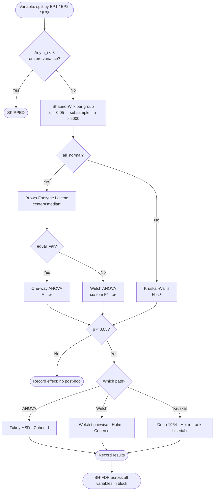

# SCIENTIFIC NOTES — LEC–Field Dependence Analysis

*Internal laboratory report. Last updated: 2026-04-22. Reorganized as scientific report: 2026-04-22.*
*Authors: Danilo Couto de Souza. Contact: danilocs@usp.br*

---

## Table of Contents

1. [Scientific Context and Research Questions](#1-scientific-context-and-research-questions)
2. [Data and Sample](#2-data-and-sample)
3. [Derived Fields and Feature Extraction](#3-derived-fields-and-feature-extraction)
4. [Statistical Framework and Test Selection](#4-statistical-framework-and-test-selection)
5. [Metrics Used and How to Interpret Them](#5-metrics-used-and-how-to-interpret-them)
6. [Inter-EP Significance: Empirical Results](#6-inter-ep-significance-empirical-results-april-2026-run)
7. [LEC–Field Association Analysis](#7-lecfield-association-analysis)
8. [Main Findings: Synthesis](#8-main-findings-synthesis)
9. [Interpretation Guide for Pipeline Figures](#9-interpretation-guide-for-pipeline-figures)
10. [Assumptions](#10-assumptions)
11. [Caveats and Limitations](#11-caveats-and-limitations)
12. [Next Steps](#12-next-steps)
13. [References](#13-references)
- [Appendix A: Decision Flowchart](#appendix-a-decision-flowchart)
- [Appendix B: Statistical Tests — Consolidated Reference](#appendix-b-statistical-tests--consolidated-reference)
- [Appendix C: Algorithmic Pseudocode](#appendix-c-algorithmic-pseudocode)

---

## 1. Scientific Context and Research Questions

### Background

The Energy Pattern (EP) classification groups South Atlantic extratropical cyclones by
their dominant energetic regime during the intensification phase.  EP1, EP2, and EP3
were derived from PCA-based K-Means clustering on Lorenz Energy Cycle (LEC) diagnostics
computed from ERA5 reanalysis.  The subsequent composite analysis (pipeline:
`ep_structure_analysis`) revealed distinct atmospheric structures for each EP at the
group-mean level.

However, composite analysis captures *mean differences*: it tells us what the *average*
EP1, EP2, or EP3 cyclone looks like synoptically — but not how strongly the atmospheric
structure of an individual cyclone relates to its LEC signature.  This analysis bridges
that gap.

### Research Questions

1. **Inter-EP differences in LEC terms**: Do EP1, EP2, and EP3 cyclones diverge
   significantly in their LEC term magnitudes?  Which terms show the largest differences,
   and which EP pairs are most distinct?

2. **Inter-EP differences in synoptic structure**: Do the spatial features of the ERA5
   dynamic fields (PV, temperature advection, AFC, KE advection) differ systematically
   between EPs?  Which field–feature combinations are the strongest EP discriminators?

3. **LEC–field predictive associations**: Within each EP, do spatial structural features
   of the dynamic fields quantitatively predict LEC term magnitudes?
   - Primary measure: Spearman rank correlation ρ (monotonic association, directional).
   - Complementary measure: PREDEP α (non-parametric predictive dependence).

4. **Absolute vs. anomaly fields**: Does using EPALL-relative anomaly fields (isolating
   EP-specific structure) produce stronger or weaker LEC–field associations compared to
   absolute fields?

5. **Feature informativeness**: Which spatial features (e.g., zonal contrast, domain
   mean, NW quadrant mean) of which fields carry the most information about which LEC
   terms — and is this consistent across EPs or EP-specific?

---

## 2. Data and Sample

### 2.1 LEC Terms

**Source**: LEC results deposited on Zenodo (DOI: 10.5281/zenodo.18243447), 3-hourly
time series with 32 vertical levels, covering South Atlantic extratropical cyclones
identified in the Petrobras/CENPES cyclone database.

**Temporal averaging**: For this analysis, each LEC term is represented by its mean over
the **central 2–3 timesteps** of the intensification phase (the same temporal window
used in the `ep_structure_analysis` composites):

| Intensification length (N) | Timesteps selected |
|---|---|
| Odd N | 3 central: `[N//2−1, N//2, N//2+1]` |
| Even N | 2 central: `[N//2−1, N//2]` |
| N ≤ 3 | All timesteps |

Only cyclones with intensification duration > 24 h (N > 8 at 3-hourly resolution) are
included.  This ensures that the LEC snapshot and the ERA5 spatial snapshot are
temporally co-located.

**Terms analysed** — all 24 LEC terms are tested for inter-EP differences; the
**canonical 7** (`Ca`, `Ck`, `BAe`, `BKe`, `Ae`, `Ke`, `Ge`) are the primary analysis
terms for the association figures (they match the terms used to define EPs via
clustering):

| Term | Description | Units |
|------|-------------|-------|
| $A_z$ | Zonal available potential energy | W m⁻² |
| $A_e$ | Eddy available potential energy | W m⁻² |
| $K_z$ | Zonal kinetic energy | W m⁻² |
| $K_e$ | Eddy kinetic energy | W m⁻² |
| $C_z$ | Zonal APE → Zonal KE | W m⁻² |
| $C_a$ | Zonal APE → Eddy APE (baroclinic) | W m⁻² |
| $C_k$ | Eddy KE → Zonal KE (barotropic indicator) | W m⁻² |
| $C_e$ | Eddy APE → Eddy KE | W m⁻² |
| $BA_z, BA_e$ | Boundary APE fluxes | W m⁻² |
| $BK_z, BK_e$ | Boundary KE fluxes | W m⁻² |
| $B\Phi_Z, B\Phi_E$ | Boundary pressure work | W m⁻² |
| $G_z, G_e$ | APE generation (zonal, eddy) | W m⁻² |
| $RG_z, RK_z, RG_e, RK_e$ | Residuals | W m⁻² |
| $\partial X/\partial t$ | Energy tendencies (Az, Ae, Kz, Ke) | W m⁻² |

> **Note on canonical set**: `Ce`, `Cz`, and `Gz` were erroneously included in
> `LEC_TERMS_CORE` in earlier pipeline versions.  They are not part of the PCA-based
> clustering.  The canonical set was corrected (2025-04-19) to the 7 terms above.

### 2.2 ERA5 Dynamic Fields

**Source**: ERA5 reanalysis, 0.25° resolution, storm-centred 30°×30° domain extracted
from per-cyclone netCDF files in `data/era5_ep_structure/`.

**Derivation (step 3b)**: Raw files contain pressure-level `u`, `v`, `t`, `z`, `q`.
The five dynamic diagnostics are computed by `step3b_derive_era5_fields.py` using the
same diagnostic functions as `ep_structure_analysis`:

| Field | Level | Formula |
|-------|-------|---------|
| `pv_850` | 850 hPa | Ertel PV: $q = -g\,(\partial\theta/\partial p)\,\zeta_a$ (MetPy 3-level FD) |
| `pv_200` | 200 hPa | Same formula |
| `adv_T_850` | 850 hPa | $-\mathbf{V} \cdot \nabla T$ (MetPy spherical gradients) |
| `ke_adv_250` | 250 hPa | $-\mathbf{V} \cdot \nabla(\tfrac{1}{2}|\mathbf{V}|^2)$ |
| `afc_250` | 250 hPa | $-\nabla \cdot (\mathbf{V}_a K)$ (Orlanski & Katzfey 1991) |

ERA5 fields use the **single central timestep** of the intensification phase.

Two versions: **absolute** (raw derived field) and **EPALL-relative anomaly** (cyclone
field − EPALL composite mean).

### 2.3 Sample Sizes

| EP | N | % of total |
|----|---|--|
| EP1 | 332 | 12% |
| EP2 | 776 | 28% |
| EP3 | 1,625 | 60% |
| **Total** | **2,733** | 100% |

Group imbalance (factor ~5 across EPs) is intrinsic to the clustering solution and is
handled by the rank-based statistical tests used throughout.

---

## 3. Derived Fields and Feature Extraction

### 3.1 Feature Set (Current Pipeline Outputs)

Each 2D storm-centred field is summarised into 13 scalar features computed on the inner
15°×15° box centred on the cyclone (`step4_extract_features_absolute.py`,
`step5_extract_features_anomaly.py`).

| Feature | Definition |
|---|---|
| `domain_mean` | Spatial mean over the inner box |
| `centre_value` | Value at cyclone centre pixel |
| `border_north/south/east/west` | Mean over 5-cell-thick strip (1.25°) along each edge of inner box (strip spans full 15° edge length) |
| `contrast_ew` | $\bar{f}_E - \bar{f}_W$ (zonal asymmetry) |
| `contrast_sn` | $\bar{f}_S - \bar{f}_N$ (meridional asymmetry) |
| `sector_north/south/east/west` | Mean over cardinal sector (N/S/E/W half) of inner box |
| `domain_abs_mean` | $\overline{|f|}$ (mean absolute value) |

> **Feature set updated 2026-04-22:** `utils_features.py` was updated to replace
> diagonal quadrant means with cardinal sector means (`sector_north`, `sector_south`,
> `sector_east`, `sector_west`).  Step 4 was rerun on 2026-04-22 and all downstream
> steps (5–9) were regenerated accordingly.  All current results use sector features.

### 3.2 Feature Design Rationale

- `domain_mean`: overall field intensity; tends toward zero for signed fields
- `domain_abs_mean`: overall intensity for signed fields where sign cancellation matters
  (most useful for temperature advection and AFC)
- Border means: sharp spatial gradients on each side
- Contrasts: E–W = baroclinic tilt proxy; S–N = frontal structure proxy
- Sector means: capture structural asymmetry in each cardinal direction (N/S/E/W half-box means)

Total: 5 fields × 13 features × 2 types (absolute + anomaly) = **130 variables**
tested for inter-EP differences, plus 24 LEC terms = **154 variables** total.

---

## 4. Statistical Framework and Test Selection

### 4.1 Overview

Every scalar variable in the pipeline is tested for statistically significant
differences between EP1, EP2, and EP3 using a pre-specified decision tree
(implemented in `utils_statistical_tests.py`, orchestrated by
`step7b_ep_significance_tests.py`).  This is independent of the correlation / PREDEP
analysis and answers: *do EPs actually differ on this variable?*

### 4.2 Decision Tree

**Step 1 — Normality (Shapiro–Wilk, α = 0.05 per group):**
For n > 5,000, a subsample of 5,000 is used (seed = 42; over-rejection warning noted).

**Step 2 — Variance homogeneity (Brown–Forsythe–Levene, center='median'):**
Applied only when all groups pass normality.

**Step 3 — Global test selection:**

| Condition | Test | Effect size |
|-----------|------|-------------|
| All normal + equal variances | One-way ANOVA | $\omega^2$ |
| All normal + unequal variances | Welch ANOVA (custom impl.) | $\omega^2$ |
| ≥ 1 group non-normal | **Kruskal–Wallis** | $\varepsilon^2 = (H - k + 1)/(N - k)$ |

**Step 4 — Post-hoc pairwise tests (only if global p < α):**

| After | Post-hoc | Multiple-comp. correction | Pairwise effect size |
|-------|----------|--------------------------|---------------------|
| ANOVA | Tukey HSD | FWER (internal) | Cohen's *d* |
| Welch ANOVA | Pairwise Welch *t* | Holm step-down | Cohen's *d* |
| **Kruskal–Wallis** | **Dunn (1964)** | **Holm step-down** | rank-biserial *r* |

**Step 5 — Cross-variable correction:**
Benjamini–Hochberg FDR applied to all global test raw p-values within each block
(LEC terms, absolute features, anomaly features independently).

### 4.3 Effect Size Reference

| Measure | Context | Thresholds |
|---------|---------|------------|
| $\varepsilon^2$ | Kruskal–Wallis global | < 0.01 negligible; 0.01–0.06 small; 0.06–0.14 medium; > 0.14 large |
| $\omega^2$ | ANOVA/Welch global | Same thresholds |
| rank-biserial *r* | Non-parametric pairwise | < 0.10 negligible; 0.10–0.30 small; 0.30–0.50 medium; > 0.50 large |
| Cohen's *d* | Parametric pairwise | 0.20 small; 0.50 medium; 0.80 large |

### 4.4 Statistical Tests: Summary Reference Table

The table below provides a consolidated view of all tests in the pipeline, intended as
a reference for writing the methods section of the paper.

| Scenario | Global test | Global statistic | Global effect size | Post-hoc | Pairwise correction | Pairwise effect size | Cross-var. correction |
|----------|-------------|------------------|--------------------|----------|--------------------|-----------------------|----------------------|
| All groups normal, equal variance | One-way ANOVA | *F* | *ω²* | Tukey HSD | FWER (internal) | Cohen's *d* | BH-FDR |
| All groups normal, unequal variance | Welch ANOVA | *F\** | *ω²* | Pairwise Welch *t* | Holm | Cohen's *d* | BH-FDR |
| Any group non-normal | **Kruskal–Wallis** | *H* | **ε²** | **Dunn (1964)** | **Holm** | **rank-biserial *r*** | **BH-FDR** |

**In the April 2026 run: 100% of variables (154/154) took the Kruskal–Wallis path.**
The ANOVA and Welch ANOVA branches are implemented and tested but were never activated.
See Section 6 for the empirical statistical path summary.

### 4.5 Association Metrics

For each EP × LEC term × field × feature combination, within the EP subsample:

- **Spearman ρ**: Primary metric.  Monotonic rank correlation.  Robust to
  non-Gaussianity.  Directly interpretable.
- **Pearson r**: Complementary linear metric.  Divergence from Spearman indicates
  non-linear (but monotonic) structure.
- **PREDEP α**: Non-parametric predictive dependence (Assunção et al. 2025).
  Direction: X = feature, Y = LEC term.  α = 0 → independence; α = 1 → perfect
  predictability.

PREDEP estimation: bootstrap estimator with $k = \lfloor\sqrt{N}\rfloor$ Ward-linkage
bins, $n_b = \lceil N \log N \rceil$ bootstrap pairs, Scott KDE bandwidth.

---

## 5. Metrics Used and How to Interpret Them

This section provides practical guidance on interpreting all metrics used in the
pipeline.  It is aimed at laboratory members who work primarily with atmospheric
dynamics and may not routinely use these statistical measures.

### 5.1 Spearman Rank Correlation (ρ)

Spearman ρ measures the **monotonic association** between two variables: how
consistently does one increase (or decrease) when the other increases?  Unlike Pearson
correlation, it does not require the relationship to be linear — only monotonic
(consistently going in one direction).  It works by ranking both variables and computing
the Pearson correlation of the ranks.

$$\rho = 1 - \frac{6 \sum d_i^2}{n(n^2 - 1)}, \quad d_i = \text{rank}(x_i) - \text{rank}(y_i)$$

**Range**: −1 to +1.  **Sign**: direction of the association (+: both increase together;
−: one increases while the other decreases).

**Rough interpretation** (for atmospheric science context):

| |ρ| | Association |
|---|---|
| < 0.10 | Negligible / no useful linear or monotonic signal |
| 0.10–0.30 | Weak |
| 0.30–0.50 | Moderate |
| 0.50–0.70 | Strong |
| > 0.70 | Very strong |

**Practical note**: in atmospheric science, |ρ| > 0.50 across N > 300 cases typically
indicates a physically meaningful, robust relationship.  The sign matters: a negative
ρ between temperature advection and baroclinic conversion is physically expected (warm
advection drives APE release).

### 5.2 Pearson Correlation (r)

Pearson r measures the **linear** association: how well does a straight line explain the
co-variation of X and Y?  Same range (−1 to +1) and interpretation thresholds as
Spearman, but more sensitive to outliers and requires approximate linearity.

**In this analysis**: Pearson and Spearman almost always agree closely (see
`figures/exploratory/explore_predep_vs_correlations.png`).  A notable divergence
between Pearson and Spearman for the same pair suggests either (a) outliers driving
the Pearson value or (b) a non-linear part of the relationship.  Work from Spearman
as the primary metric.

### 5.3 PREDEP Predictive Dependence (α)

PREDEP (Assunção et al. 2025) measures **how much knowing X reduces uncertainty in Y**,
without assuming any specific functional form (linear, monotonic, or otherwise).

$$\alpha_{\text{Y|X}} = \frac{S_{\text{Y|X}} - S_{\text{Y}}}{S_{\text{Y|X}}}$$

where $S_{\text{Y}}$ is the unconditional "scoring dispersion" of Y and
$S_{\text{Y|X}}$ is the dispersion of Y conditional on X, estimated via Ward-linkage
bins in the X space.  Division by $S_{\text{Y|X}}$ normalises to [0, 1].

**Range**: 0 to 1.  **α = 0**: X and Y are independent (knowing X does not help
predict Y).  **α = 1**: X perfectly determines Y.

**Relationship to correlation**: if X and Y have a strong linear relationship, both
PREDEP and |Spearman| will be high.  However, PREDEP can also be high when there is
a non-monotonic but structured relationship (e.g., a U-shaped pattern), while Spearman
would return ρ ≈ 0.

**A critical observation in this dataset**: the PREDEP baseline ("floor") is not
zero — it ranges from ~0.19 to ~0.31 even for variable pairs with near-zero Spearman ρ.
This is expected: the PREDEP estimator has finite-sample bias, particularly for
the sample sizes here (EP1: 332, EP2: 776, EP3: 1,625).  The mean PREDEP across all
pairs is ~0.56–0.61, substantially above zero.  **This means PREDEP values should not
be interpreted in isolation** — they are most informative when comparing values within
the same EP and looking for relative ordering, or when compared against the Spearman ρ
of the same pair.

**Summary of PREDEP baseline statistics (April 2026 run):**

| EP | N | Min PREDEP | Median PREDEP | Max PREDEP |
|---|---|---|---|---|
| EP1 | 332 | 0.196 | 0.574 | 0.712 |
| EP2 | 776 | 0.189 | 0.579 | 0.706 |
| EP3 | 1,625 | 0.308 | 0.621 | 0.746 |

EP3 shows a higher minimum, consistent with a larger N reducing estimator variance and
genuine structural co-variation in the higher-N group.

**Practical interpretation guide** (relative to the observed baseline):

| PREDEP value | Interpretation |
|---|---|
| < 0.40 | Below baseline; effectively zero dependence |
| 0.40–0.55 | Near-baseline; weak or no signal |
| 0.55–0.65 | Moderate dependence above baseline |
| 0.65–0.75 | Strong dependence; confident association |
| > 0.75 | Very strong dependence |

### 5.4 Epsilon-Squared (ε²) — Global Effect Size

ε² is the effect size for Kruskal–Wallis, computed as:

$$\varepsilon^2 = \frac{H - k + 1}{N - k}$$

where $H$ is the Kruskal–Wallis statistic, $k$ = 3 groups, $N$ = total sample.
It is analogous to η² in ANOVA and measures the **proportion of variance in ranks
explained by group membership**.

**Range**: 0 to 1.  A higher ε² means EP assignment explains more of the
variability in the variable.

**Threshold reference** (standard guidelines):

| ε² | Practical class |
|---|---|
| < 0.01 | Negligible |
| 0.01–0.06 | Small |
| 0.06–0.14 | Medium |
| > 0.14 | Large |

**Physical reading**: ε² = 0.40 for $K_e$ means that roughly 40% of the rank-order
variability in eddy kinetic energy can be explained by knowing which Energy Pattern a
cyclone belongs to.  That is a very large effect in atmospheric science.

### 5.5 Rank-Biserial r — Pairwise Effect Size

The rank-biserial r is used for Dunn post-hoc contrasts (pairwise comparisons between
two EP groups).  It is estimated from the Mann–Whitney U statistic:

$$r_{\text{rb}} = 1 - \frac{2U}{n_i \cdot n_j}$$

**Range**: −1 to +1.  **Sign**: which group tends to have larger values.  A positive
sign means group *i* has higher ranks (higher values) than group *j*.

**Threshold reference:**

| |r_rb| | Practical class |
|---|---|
| < 0.10 | Negligible |
| 0.10–0.30 | Small |
| 0.30–0.50 | Medium |
| > 0.50 | Large |

**Example**: r_rb = 0.60 for EP2 vs EP3 on $K_e$ means EP2 cyclones tend to have
substantially larger eddy kinetic energy than EP3 cyclones — a large, systematic
difference.

### 5.6 p-value, BH-FDR, and Holm Correction

**Raw p-value**: the probability of observing a test statistic as extreme as the one
computed if the null hypothesis (no group differences) were true.  In this analysis,
p-values are used only as a binary gate (< 0.05 or not) after correction.

**Benjamini–Hochberg FDR (BH-FDR)**: applied *globally* across all variables within
each block (LEC, absolute features, anomaly features).  Controls the expected
proportion of false discoveries among significant results.  More permissive than
Bonferroni but appropriate for discovery-oriented analyses.

**Holm correction**: applied *locally* to the 3 pairwise contrasts (EP1/EP2,
EP1/EP3, EP2/EP3) within each variable.  Step-down procedure, controls familywise
error rate.  More powerful than Bonferroni for small numbers of tests.

**Practical note**: because all 154 variables passed the global KW test (p_raw
extremely small, often < 10⁻⁵⁰), the BH-FDR correction had no effect in practice —
the adjusted p-values remained significant.  The Holm correction on pairwise contrasts
did suppress a modest number of weak pairwise effects.

---

## 6. Inter-EP Significance: Empirical Results (April 2026 Run)

*Source data: `results/lec_field_dependence/step7b_diagnostic_table.csv`,
`step7b_pairwise_table.csv`, `step7b_significance_report.txt` (generated 2026-04-22).*

### 6.1 Statistical Path Actually Observed

**This is a key section: it describes what the decision tree did in practice, not just
what it was designed to do.**

| Criterion | Result |
|---|---|
| Total variables tested | 154 |
| all_normal = True (all 3 EP groups pass Shapiro–Wilk) | **0 / 154 (0%)** |
| Took ANOVA or Welch ANOVA path | **0 / 154 (0%)** |
| Took Kruskal–Wallis path | **154 / 154 (100%)** |
| Post-hoc test used | **Dunn (1964) with Holm step-down** |
| Pairwise effect size reported | **rank-biserial r** |
| Global effect size reported | **ε² (epsilon-squared)** |
| Cross-variable correction | **Benjamini–Hochberg FDR** |

**Explanation**: With EP1 n = 332, EP2 n = 776, EP3 n = 1,625, Shapiro–Wilk is highly
powered and detected non-normality in every tested group.  LEC terms (especially
conversion and residual terms) and ERA5-derived features (PV, advection) are
intrinsically skewed or heavy-tailed.  The ANOVA and Welch ANOVA branches are correctly
implemented in the code but were never activated in this dataset.

**Practical implication for methods writing**: All significance claims are backed by
Kruskal–Wallis (global, H-statistic, ε²) + Dunn post-hoc (pairwise, z-statistic, rank-
biserial r), with Holm correction for pairwise tests and BH-FDR across variables.

### 6.2 Significance Summary by Block

| Block | Variables | Sig (BH-adj p < 0.05) | Not significant |
|---|---|---|---|
| LEC terms | 24 | **24 / 24** | 0 |
| Absolute features | 65 | **59 / 65** | 6 |
| Anomaly features | 65 | **60 / 65** | 5 |

### 6.3 Pairwise Contrast Summary

| EP pair | Significant (out of 143 contrasted) | % |
|---|---|---|
| EP1 vs EP2 | 99 | 69% |
| EP1 vs EP3 | 114 | 80% |
| **EP2 vs EP3** | **120** | **84%** |

EP1 vs EP3 and EP2 vs EP3 show the most pervasive differences.  These contrasts pit
the high-energy EP1/EP2 against the much larger, low-energy EP3 group, so strong
differences are expected.  EP1 vs EP2 is the most subtle contrast (69% significant),
reflecting that these two groups occupy overlapping but distinct energetic regimes.

### 6.4 LEC Terms: Which Differ Between EPs

All 24 LEC terms are significant (BH-adj p < 0.05).  Table sorted by global ε².
Bold marks contrasts with large pairwise effect |r| > 0.50.

| Term | ε² | Effect class | Significant pairwise contrasts (Dunn–Holm) |
|---|---|---|---|
| $K_e$ | **0.396** | Large | EP2>EP1 (r=0.20); **EP1>EP3 (r=0.60)**; **EP2>EP3 (r=0.79)** |
| $RK_e$ | 0.290 | Large | EP1>EP2 (r=0.15); **EP3>EP1 (r=0.50)**; **EP3>EP2 (r=0.68)** |
| $C_e$ | 0.286 | Large | EP2>EP1 (r=0.25); EP1>EP3 (r=0.42); **EP2>EP3 (r=0.69)** |
| $C_a$ | 0.278 | Large | **EP1>EP3 (r=0.58)**; **EP2>EP3 (r=0.64)** *(EP1 ≈ EP2)* |
| $A_e$ | 0.276 | Large | EP2>EP1 (r=0.23); EP1>EP3 (r=0.47); **EP2>EP3 (r=0.66)** |
| $RG_e$ | 0.178 | Large | EP1>EP3 (r=0.45); **EP2>EP3 (r=0.51)** *(EP1 ≈ EP2)* |
| $G_e$ | 0.143 | Large | EP2>EP1 (r=0.22); EP1>EP3 (r=0.23); **EP2>EP3 (r=0.50)** |
| $C_k$ | 0.108 | Medium | EP2>EP1 (r=0.20); **EP3>EP1 (r=0.54)**; EP3>EP2 (r=0.29) |
| $RK_z$ | 0.103 | Medium | EP1>EP3 (r=0.36); EP2>EP3 (r=0.39) |
| $BK_z$ | 0.081 | Medium | EP3>EP1 (r=0.27); EP3>EP2 (r=0.36); EP1>EP2 (r=0.08) |
| $\partial K_e/\partial t$ | 0.073 | Medium | EP1>EP3 (r=0.36); EP2>EP3 (r=0.30) |
| $B\Phi_Z$ | 0.072 | Medium | EP2>EP1 (r=0.32); EP2>EP3 (r=0.35) |
| $BA_z$ | 0.069 | Medium | EP1>EP2 (r=0.25); EP1>EP3 (r=0.44); EP2>EP3 (r=0.21) |
| $RG_z$ | 0.061 | Medium | EP3>EP1 (r=0.29); EP3>EP2 (r=0.29) |
| $B\Phi_E$ | 0.057 | Small | EP2>EP1 (r=0.36); EP3>EP1 (r=0.09); EP2>EP3 (r=0.29) |
| $BK_e$ | 0.046 | Small | EP2>EP1 (r=0.18); EP1>EP3 (r=0.09); EP2>EP3 (r=0.29) |
| $A_z$ | 0.038 | Small | EP1>EP2 (r=0.33); EP1>EP3 (r=0.35) *(EP2 ≈ EP3)* |
| $\partial A_e/\partial t$ | 0.034 | Small | EP1>EP2 (r=0.20); EP1>EP3 (r=0.34); EP2>EP3 (r=0.11) |
| $C_z$ | 0.027 | Small | EP1>EP2 (r=0.15); EP3>EP2 (r=0.22) |
| $K_z$ | 0.024 | Small | EP1>EP3 (r=0.16); EP2>EP3 (r=0.19) |
| $G_z$ | 0.024 | Small | EP2>EP1 (r=0.13); EP3>EP1 (r=0.26); EP3>EP2 (r=0.13) |
| $\partial A_z/\partial t$ | 0.015 | Small | EP1>EP2 (r=0.13); EP3>EP2 (r=0.17) |
| $BA_e$ | 0.009 | Negligible | EP2>EP1 (r=0.17); EP3>EP1 (r=0.16) |
| $\partial K_z/\partial t$ | 0.005 | Negligible | EP1>EP3 (r=0.09); EP2>EP3 (r=0.08) |

Note: pairwise r values shown as absolute magnitude; direction stated explicitly in
"direction" column of step7b_pairwise_table.csv.

**Physical summary of LEC inter-EP differences:**

- **Eddy energy terms dominate** ($A_e$, $K_e$, $C_e$, $C_a$, ε² = 0.28–0.40):
  these are the primary EP discriminators, consistent with the EP classification
  being grounded in the eddy PCA component.
- **EP3 has dramatically lower eddy kinetic energy and baroclinic conversion** than
  EP1 and EP2 (large r values for EP1>EP3 and EP2>EP3 for $K_e$, $C_a$, $C_e$).
- **EP3 has distinctly higher barotropic conversion** ($C_k$; EP3>EP1, r=0.54),
  identifying EP3 as the barotropically dominated class.
- **$C_a$ does not differ between EP1 and EP2** (only 2/3 pairs significant):
  baroclinic conversion levels are similar in EP1 and EP2; EP3 is the outlier.
- **Canonical 7 terms** (Ca, Ck, BAe, BKe, Ae, Ke, Ge) all show significant
  inter-EP differences, validating the EP clustering.
- **$BA_e$ and $\partial K_z/\partial t$** have negligible ε² (< 0.01) despite
  statistical significance — these are large-sample artefacts; treat as
  indistinguishable across EPs for practical purposes.

### 6.5 Dynamic Field Features: Which Differ Between EPs

#### Top features by ε² (absolute; top 10)

| Feature | ε² | Effect class |
|---|---|---|
| `afc_250__domain_abs_mean` | **0.179** | Large |
| `pv_200__contrast_ew` | 0.132 | Medium |
| `ke_adv_250__domain_abs_mean` | 0.123 | Medium |
| `adv_T_850__sector_north` | 0.111 | Medium |
| `adv_T_850__sector_west` | 0.095 | Medium |
| `adv_T_850__border_north` | 0.094 | Medium |
| `adv_T_850__domain_mean` | 0.075 | Medium |
| `ke_adv_250__border_south` | 0.060 | Medium |
| `ke_adv_250__sector_west` | 0.048 | Small |
| `adv_T_850__domain_abs_mean` | 0.042 | Small |

#### Top features by ε² (anomaly; top 10)

| Feature | ε² | Effect class |
|---|---|---|
| `afc_250_anom_epall__domain_abs_mean` | **0.166** | Large |
| `pv_200_anom_epall__contrast_ew` | 0.132 | Medium |
| `ke_adv_250_anom_epall__domain_abs_mean` | 0.114 | Medium |
| `adv_T_850_anom_epall__sector_north` | 0.111 | Medium |
| `adv_T_850_anom_epall__sector_west` | 0.095 | Medium |
| `adv_T_850_anom_epall__border_north` | 0.094 | Medium |
| `adv_T_850_anom_epall__domain_mean` | 0.075 | Medium |
| `ke_adv_250_anom_epall__border_south` | 0.060 | Medium |
| `ke_adv_250_anom_epall__sector_west` | 0.048 | Small |
| `adv_T_850_anom_epall__contrast_sn` | 0.040 | Small |

#### Features NOT significantly different between EPs (after BH-FDR)

**Absolute features — 6 non-significant:**

| Feature | ε² | Interpretation |
|---|---|---|
| `pv_200__centre_value` | 0.000 | Centre-point PV 200: no EP signal |
| `ke_adv_250__sector_north` | 0.000 | KE adv northern sector: no EP signal |
| `pv_200__domain_abs_mean` | 0.001 | PV 200 absolute mean: no EP signal |
| `pv_200__domain_mean` | 0.001 | Overall PV 200 level does not differ between EPs |
| `ke_adv_250__border_north` | 0.001 | Northern border KE advection: no EP signal |
| `pv_200__sector_north` | 0.001 | PV 200 northern sector: no EP signal |

**Anomaly features — 5 non-significant:**

| Feature | ε² | Interpretation |
|---|---|---|
| `pv_200_anom_epall__centre_value` | 0.000 | Centre PV 200 anomaly: no EP signal |
| `ke_adv_250_anom_epall__sector_north` | 0.000 | KE adv northern sector anomaly: no EP signal |
| `pv_200_anom_epall__domain_mean` | 0.001 | Domain-mean PV 200 anomaly: no EP signal |
| `ke_adv_250_anom_epall__border_north` | 0.001 | Northern border KE adv anomaly: no EP signal |
| `pv_200_anom_epall__sector_north` | 0.001 | PV 200 northern sector anomaly: no EP signal |

Key finding: the **PV 200 hPa domain mean**, **centre value**, and **sector_north** do
not differ between EPs in either absolute or anomaly form.  What matters for PV 200
is the *zonal gradient* (east–west contrast, ε² = 0.132), not the domain-wide
intensity level or the northern sector.  Interestingly, anomaly fields reduce the
`afc_250__domain_abs_mean` effect size slightly (0.179 → 0.166), but leave the PV 200
zonal contrast unchanged (0.132 in both versions), suggesting the zonal PV gradient is
already entirely captured by the deviation from the EPALL mean.

**Physical summary:**

- **AFC 250 hPa amplitude** (`domain_abs_mean`) is the single strongest EP discriminator
  among field features (ε² = 0.179), consistent with composite analysis showing
  markedly different AFC patterns per EP.
- **PV 200 hPa E–W contrast** (ε² = 0.132) reflects the east–west phase tilt of the
  upper-level trough relative to the surface cyclone.
- **KE advection amplitude at 250 hPa** captures jet-stream energy transport structure.
- **Temperature advection in the northern sector** (ε² = 0.111) and **western sector**
  (ε² = 0.095) capture warm advection ahead of the cold front and the warm conveyor
  belt structure — classical baroclinic signatures.  The cardinal sector formulation
  replaced the diagonal quadrant formulation (2026-04-22 rerun).
- Anomaly features produce slightly lower effect sizes than absolute features on average,
  except for `pv_200__contrast_ew` which is identical — the zonal PV contrast is
  entirely captured by the deviation from the EPALL mean.

---

## 7. LEC–Field Association Analysis

### 7.1 Status (April 2026 Run)

Steps 7 and 8 (PREDEP + Spearman association analysis) were rerun on **2026-04-22**
with the canonical central-timestep LEC method and updated sector features.  Results
below supersede the preliminary full-phase run.

### 7.2 Top Associations by Spearman ρ: Canonical LEC Terms (April 2026 Run)

The table below shows the five strongest associations (by |Spearman ρ|) for each EP,
restricted to the **canonical 7 LEC terms** (Ca, Ck, BAe, BKe, Ae, Ke, Ge) and using
the **EPALL-relative anomaly** fields (which isolate EP-specific synoptic structure).
The central-timestep LEC values and single-timestep ERA5 fields are used throughout.

| EP | LEC term | Field (anomaly) | Feature | ρ | PREDEP α |
|----|----------|-----------------|---------|---|---------|
| **EP1** | $G_e$ | PV 200 | `border_east` | +0.660 | 0.671 |
| **EP1** | $G_e$ | PV 200 | `contrast_ew` | +0.653 | 0.662 |
| **EP1** | $C_a$ | AdvT 850 | `sector_north` | −0.633 | 0.584 |
| **EP1** | $A_e$ | AdvT 850 | `sector_north` | −0.622 | 0.548 |
| **EP1** | $G_e$ | PV 200 | `sector_east` | +0.617 | 0.638 |
| **EP2** | $A_e$ | AdvT 850 | `border_north` | −0.570 | 0.580 |
| **EP2** | $G_e$ | PV 200 | `border_east` | +0.558 | 0.547 |
| **EP2** | $A_e$ | PV 200 | `contrast_ew` | +0.555 | 0.680 |
| **EP2** | $A_e$ | AdvT 850 | `sector_north` | −0.551 | 0.469 |
| **EP2** | $G_e$ | PV 200 | `contrast_ew` | +0.548 | 0.683 |
| **EP3** | $A_e$ | AdvT 850 | `sector_north` | −0.528 | 0.685 |
| **EP3** | $C_a$ | AdvT 850 | `sector_west` | −0.503 | 0.653 |
| **EP3** | $A_e$ | PV 200 | `border_west` | −0.498 | 0.669 |
| **EP3** | $C_a$ | AdvT 850 | `sector_north` | −0.470 | 0.654 |
| **EP3** | $C_a$ | AdvT 850 | `domain_mean` | −0.459 | 0.608 |

**EP1 pattern**: Diabatic generation ($G_e$) is the most predictable canonical term
from synoptic structure.  Its strongest predictor is the PV 200 eastern sector (and
zonal contrast), consistent with EP1 being associated with a pronounced upper-level
trough east of the surface cyclone.  The negative ρ between $C_a$ / $A_e$ and
temperature advection in the northern sector is physically expected: stronger warm
advection north of the cyclone (larger sector_north AdvT 850) → more efficient
baroclinic energy conversion.  (Note: sector_north is defined as the northern half of
the inner box, so positive AdvT there = warm advection ahead of the cyclone.)

**EP2 pattern**: Similar physical story but weaker associations overall (|ρ| ≤ 0.570
vs EP1 max 0.660).  PV 200 zonal contrast and AdvT 850 northern sector are again the
leading predictors.  EP2 appears to be a transitional regime between EP1 and EP3.

**EP3 pattern**: Associations are weaker (|ρ| ≤ 0.528), consistent with EP3 being the
weakest-energy, most heterogeneous group.  The temperature advection northern and
western sectors dominate, as does the PV 200 western border — a signature different
from EP1/EP2, where the *eastern* PV gradient dominated.

### 7.3 All-Term Ranking by Spearman ρ (Absolute Fields)

The single strongest associations in the full dataset (all 24 LEC terms, all fields,
all features, absolute) are dominated by **KE advection at 250 hPa**:

| EP | LEC term | Field | Feature | ρ | PREDEP α |
|----|----------|-------|---------|---|---------|
| EP3 | $BK_z$ | KE adv 250 | `domain_mean` | +0.833 | 0.746 |
| EP1 | $BK_z$ | KE adv 250 | `domain_mean` | +0.827 | 0.707 |
| EP1 | $RK_z$ | KE adv 250 | `domain_mean` | −0.802 | 0.712 |
| EP3 | $K_z$ | KE adv 250 | `domain_abs_mean` | +0.780 | 0.713 |
| EP2 | $BK_z$ | KE adv 250 | `domain_mean` | +0.764 | 0.688 |

$BK_z$ (zonal kinetic energy boundary flux) and $RK_z$ (zonal KE residual) are both
tightly related to the domain-mean KE advection at jet level — a boundary-flux
signature expected physically because zonal KE import/export is driven by the jet
structure.  This reflects that the KE advection and zonal boundary flux in the LEC are
algebraically linked: both describe the lateral transport of kinetic energy.

Note that these are NOT canonical terms; they are not used for EP classification.
Their high correlations confirm that the derived ERA5 fields and the LEC diagnostics
are grounded in the same physics but measured independently.

### 7.4 PREDEP-level Analysis

PREDEP values (across all EP × field × feature combinations) show a persistent elevated
floor, particularly for EP3.  A comparison with Spearman ρ reveals a characteristic
pattern: PREDEP is often elevated even when Spearman ρ is near zero.  For example,
`EP3 / BKz / adv_T_850 / sector_east` has PREDEP = 0.715 but ρ = +0.084, suggesting
the association has a non-monotonic or regime-based structure not captured by rank
correlation.

For the canonical terms, PREDEP is generally concordant with Spearman when |ρ| > 0.40.
Below that threshold, interpret PREDEP relative to the EP-specific baseline (see
Section 5.3 for baseline statistics).

### 7.5 Absolute vs. Anomaly Fields

The top associations are nearly identical between absolute and anomaly fields,
confirming that removing the EPALL mean does not substantially change the individual
cyclone-level associations.  The main differences are:

- `afc_250 / domain_abs_mean` drops from ε² = 0.179 (absolute) to 0.166 (anomaly)
  in the inter-EP significance analysis — removing the EPALL mean removes part of the
  between-EP AFC contrast.
- `pv_200 / contrast_ew` is unchanged (ε² = 0.132 in both) — the zonal PV gradient
  is an anomaly by nature; the EPALL mean has no east–west structure at the composite
  level.
- Spearman association analysis: EP1 top-5 canonical pairs are virtually identical
  between absolute and anomaly (differences < 0.01 in |ρ|).

---

---

## 8. Main Findings: Synthesis

This section summarises the principal results from the April 2026 run.  It is intended
as the first stop for new readers who want a top-level picture before diving into the
detailed sections above.

### 8.1 All Variables Differ Significantly Between Energy Patterns

All 24 LEC terms show significant inter-EP differences (Kruskal–Wallis, BH-adjusted
p < 0.05), with effect sizes ranging from negligible (ε² < 0.01 for $\partial K_z/\partial t$,
$BA_e$) to very large (ε² = 0.40 for $K_e$).  The eddy energy conversion chain
($A_e$, $K_e$, $C_e$, $C_a$) dominates, confirming that the EP classification is
fundamentally grounded in baroclinic/eddy energetics.

For the ERA5-derived field features, 59/65 absolute and 60/65 anomaly features differ
between EPs.  The six non-significant features all involve the domain-mean or
domain-north intensity of PV 200 hPa or the northern KE advection — directions that
lack systematic inter-EP structure.  What matters for PV 200 is the *east–west
gradient*, not the overall intensity.

### 8.2 EP3 is the Defining Contrast

In pairwise contrasts, EP3 drives most of the signal: 114 of 143 variables differ
between EP1 and EP3, and 120 of 143 differ between EP2 and EP3.  EP1 vs EP2 is a
much more subtle distinction (99/143 significant).  EP3 has:

- Dramatically lower $K_e$ and $C_a$ (baroclinic conversion)
- Distinctly higher $C_k$ (barotropic conversion), marking it as the barotropically
  dominated class
- Lower AFC domain amplitude and weaker temperature advection gradients

### 8.3 Synoptic Predictors of LEC Behaviour

For the **canonical** LEC terms and at the individual-cyclone level:

- **Diabatic generation ($G_e$, EP1)**: most predictable from upper-level PV gradient
  (east–west contrast and eastern border of PV 200) — strong association ρ ≈ +0.65.
  Consistent with the EP1 composite showing an upper-level trough east of the cyclone.

- **Baroclinic conversion ($C_a$, $A_e$, EP1/EP2)**: most predictable from
  temperature advection in the northern sector (ρ ≈ −0.63 for EP1).  Warm advection
  north of the cyclone (positive sector_north AdvT 850) drives APE release — a
  textbook warm-conveyor-belt signature.

- **EP3 associations**: weaker overall (|ρ| ≤ 0.53 for canonical terms), consistent
  with EP3 being the weakest-energy, most heterogeneous group.  The temperature
  advection western sector and PV 200 western border dominate — a structural signature
  distinct from EP1/EP2.

### 8.4 PREDEP and the Question of Non-Linear Structure

For strong associations (|ρ| > 0.50), PREDEP and Spearman are concordant and mutually
reinforcing.  For weak associations (|ρ| < 0.20), PREDEP shows an elevated floor
(~0.55 for canonical pairs) that does not necessarily indicate dependence — it reflects
finite-sample PREDEP estimator bias at these sample sizes.  Simple high PREDEP values
should not be interpreted as physical signal without a corroborating Spearman or
physical reasoning.

The most striking "discordant" pairs (high PREDEP, near-zero Spearman) in the dataset
involve non-canonical LEC terms with non-monotonic dependencies.  These are candidates
for further exploration but are outside the scope of the primary paper analysis.

---

## 9. Interpretation Guide for Pipeline Figures

### 9.1 Label Convention

All figure labels for dynamic features follow: **Field Label — Feature Label**

| Field Label | Meaning |
|---|---|
| PV 850 | Potential vorticity at 850 hPa (absolute) |
| PV 200 | Potential vorticity at 200 hPa (absolute) |
| AdvT 850 | Temperature advection at 850 hPa (absolute) |
| AFC 250 | Ageostrophic flux convergence at 250 hPa (absolute) |
| KE adv 250 | Kinetic energy advection at 250 hPa (absolute) |
| …anom | EPALL-relative anomaly version of above |

| Feature Label | Meaning |
|---|---|
| domain mean | Spatial mean over the inner domain |
| centre value | Value at the cyclone centre pixel |
| border N/S/E/W | Mean along the border strip |
| E–W contrast | border_east − border_west |
| S–N contrast | border_south − border_north |
| sector N/S/E/W | Cardinal sector mean (half-box in each direction) |
| domain \|mean\| | Mean absolute value |

### 9.2 Figure Family Reference

#### Significance heatmap (`significance_heatmap_*.png`)

Binary (red/grey) matrix — rows = variables, columns = EP pair contrasts.
Red = statistically significant at p_adj < 0.05; grey = not significant.
- Full-red row: variable distinguishes all EP pairs.
- Full-red column: that EP pair differs in many variables.
- **Always cross-reference with the effect size heatmap.**

#### Effect size heatmap (`effect_size_heatmap_*.png`)

Discrete colour heatmap of |rank-biserial r| (pairwise), sorted by variable name.
Non-significant cells annotated "ns"; significant cells framed with black border.

**Discrete colour convention** (applies to both standard and `_discrete.png` variants):

| Colour | |r| range | Practical interpretation |
|---|---|---|
| Grey | < 0.10 | Negligible — can be ignored |
| Light yellow | 0.10–0.20 | Small |
| Yellow | 0.20–0.30 | Small–moderate |
| Yellow-orange | 0.30–0.40 | Moderate |
| Amber | 0.40–0.50 | Moderate |
| Orange | 0.50–0.60 | Large |
| Deep orange | 0.60–0.70 | Large |
| Orange-red | 0.70–0.80 | Very large |
| Red-orange | 0.80–0.90 | Very large |
| Red | ≥ 0.90 | Extreme |

New discrete variant files (generated `step8b_effect_heatmap_discrete.py`, 2026-04-22):
- `effect_size_heatmap_*_discrete.png` — pairwise |r| with legend
- `effect_size_global_*_discrete.png` — global ε² per variable

#### Effect ranking (`effect_ranking_*.png`)

Top 20 variables sorted by global ε² (Kruskal–Wallis).  Red = significant.
This is the **single most informative figure** for identifying which features matter.

#### Volcano plot (`volcano_*.png`)

Effect size (x) vs −log₁₀(p_adj) (y).  Top-right = high-confidence findings.
Points above the dashed line are significant (p_adj < 0.05).

#### PREDEP heatmap (step 8)

α values for each EP × LEC × field–feature combination.
- Discrete scale: grey < 0.10, light red → dark red (bins at 0.10, 0.30, 0.50, 0.70, 0.90).
- Primary reading: dark rows (predictable LEC terms) and dark columns (informative features).

#### Spearman / Pearson heatmaps (`diagnostics/correlation_heatmaps/`)

Same matrix structure as PREDEP heatmaps.  Primary starting point for association
analysis: scan for dark cells, compare Spearman vs Pearson agreement, compare across EPs.

### 9.3 Recommended Reading Order

1. **Section 8** (Main Findings) — start here for a top-level picture
2. **Effect ranking** (step 8b figures) — which features/terms have the largest inter-EP effect?
3. **Volcano plot** — confirm which results are also statistically robust
4. **Spearman heatmaps** (`diagnostics/correlation_heatmaps/`) — identify direction and strength of LEC–field associations
5. **PREDEP heatmap** — cross-check for non-monotonic structure; interpret relative to EP-specific baseline (Section 5.3)
6. **Top associations bar chart** (step 8) — synthetic PREDEP ranking
7. **Physical plausibility** — are the leading results mechanistically grounded (Sections 7–8)?

### 9.4 Statistical vs. Physical Significance

A p-value < 0.05 is a *necessary*, not *sufficient*, condition for scientific relevance.

1. **Effect size first.** Variables with ε² < 0.01 (BA_e, ∂Kz/∂t) are practically
   negligible regardless of p-value.
2. **Global test before pairwise.** Post-hoc contrasts are only interpretable if the
   global KW test is also significant.
3. **FDR-adjusted p for discovery claims.** Use `global_p_adjusted` from the diagnostic
   table when claiming EP differences.
4. **Physical mechanism must be plausible.** A significant Ca difference between EP1
   and EP3 is scientifically meaningful; a significant edge-feature difference in a
   weakly-forced field may be noise even at p < 0.05.
5. **Consistency across metrics.** Variables that are both significantly different between
   EPs (step 7b) AND show high Spearman ρ within an EP are the strongest candidates for
   physical interpretation.

---

## 10. Assumptions

1. **Central-timestep representativeness**: 2–3 central intensification timesteps
   represent the mature cyclone structure.  Shared with `ep_structure_analysis`.

2. **Temporal alignment**: LEC means and ERA5 fields are extracted from the same
   central timesteps.  The former mismatch (full-phase LEC vs single ERA5 snapshot) was
   removed.

3. **Storm-centred domain adequacy**: 30°×30° domain captures synoptic-scale structure
   relevant to the LEC.  Nearby system contamination is possible for some cases.

4. **EP label independence (within-EP analysis)**: The EP label is derived from the
   same LEC values being analysed, creating a group-level circularity.  Within-EP
   analyses (PREDEP, Spearman) are not affected: they use EP only as a stratification,
   not as a predictor.

5. **PREDEP estimator validity**: Bootstrap estimator requires adequate n.  EP1 (332)
   is marginal; EP2 (776) and EP3 (1,625) are adequate.

---

## 11. Caveats and Limitations

### 11.1 Statistical Caveats

1. **Large-sample Shapiro–Wilk over-rejection**: 100% of variables took the
   non-parametric path because Shapiro–Wilk rejected normality for every group.
   At n = 332–1,625 this is expected even for nearly Gaussian distributions.
   The KW + Dunn path is conservative but may miss distributional subtleties.

2. **Unbalanced groups** (EP1:EP2:EP3 ≈ 1:2:5): rank-based tests handle this
   gracefully; pairwise contrasts involving EP1 have wider confidence intervals.

3. **Multiple testing exposure**: 154 global tests + ~462 pairwise tests.  BH-FDR and
   Holm corrections are applied.  Variables with ε² < 0.01 that survive correction
   likely reflect genuine but practically negligible signal.

4. **Correlated test variables**: features from the same field are correlated.
   FDR correction under positive correlation is still valid (BH under PRDS is
   conservative), but number of "discoveries" is reduced.

5. **No post-hoc for non-significant global test**: if a variable's global KW p ≥ 0.05,
   no pairwise contrasts are computed (even if some pairs might differ).

### 11.2 Methodological Risks

- **PREDEP floor**: confirmed in the April 2026 run (see Section 5.3 for statistics).
  Minimum PREDEP ≈ 0.19–0.31 across EPs; mean ≈ 0.56–0.61.  Interpretation of raw
  PREDEP values without reference to the EP-specific baseline is unreliable.
  Bootstrap confidence intervals for PREDEP are not yet computed.
- **Ward linkage bin choice for PREDEP**: may be sub-optimal for multimodal LEC
  distributions.
- **Fixed PREDEP bin count** $k = \lfloor\sqrt{N}\rfloor$: over-resolves for EP3; may
  under-resolve for EP1.

---

## 12. Next Steps

### Completed (as of 2026-04-22)

- [x] **Rerun step 4 with updated sector features** — completed 2026-04-22.  Steps 5–9
  also rerun.  All results now use cardinal sector features.
- [x] **Regenerate step 8b figures** with discrete colour scale — completed 2026-04-22.
- [x] **Rerun steps 7 + 8** (PREDEP + Spearman) with central-timestep LEC — completed
  2026-04-22.  Results supersede all preliminary full-phase runs.
- [x] **Scientific Notes reorganization** — reorganized as scientific report 2026-04-22;
  empirical results in section 6 corrected against step7b outputs; new metrics section
  (Section 5) and synthesis section (Section 8) added; Appendix B (statistical tests
  table) added.

### Priority 3 — Analysis extensions

- [ ] **Validate physical coherence**: cross-check top associations (Ge–PV200, Ca–AdvT)
  against EP composites from `ep_structure_analysis`.  Do the cyclones with strongest
  associations also show the clearest composite structures?
- [ ] **PREDEP bootstrap confidence intervals**: compute standard errors and CIs for
  top-ranked PREDEP associations.  Needed before making strong claims.
- [ ] **Reverse direction**: $\alpha_{\text{feature}|\text{LEC}}$ — does LEC predict
  the field features (or predict the synoptic structure)?
- [ ] **Conditional PREDEP**: control for cyclone latitude/longitude to exclude
  geographic confounding.
- [ ] **Additional fields**: EGR (baroclinic instability), moisture flux divergence
  (low-level), SLP Laplacian (curvature vorticity).
- [ ] **Genesis location stratification**: re-run significance tests for cyclones
  formed in specific genesis regions (e.g., La Plata corridor vs. SE Pacific).

---

## 13. References

- Assunção, R., Figueiredo, F., et al. (2025). An Interpretable Measure for Quantifying
  Predictive Dependence between Continuous Random Variables. *arXiv:2501.10815v1.*
- Benjamini, Y., & Hochberg, Y. (1995). Controlling the false discovery rate.
  *JRSS-B*, 57(1), 289–300.
- Benjamini, Y., & Yekutieli, D. (2001). The control of the FDR in multiple testing
  under dependency. *Annals of Statistics*, 29(4), 1165–1188.
- Dunn, O. J. (1964). Multiple comparisons using rank sums. *Technometrics*, 6(3),
  241–252.
- Orlanski, I., & Katzfey, J. (1991). The life cycle of a cyclone wave in the Southern
  Hemisphere. *J. Atmos. Sci.*, 48(17), 1972–1998.
- Razali, N. M., & Wah, Y. B. (2011). Power comparisons of Shapiro-Wilk,
  Kolmogorov-Smirnov, Lilliefors and Anderson-Darling tests. *JOSMA*, 2(1), 21–33.
- Ruxton, G. D., & Beauchamp, G. (2008). Time for some a priori thinking about post hoc
  testing. *Behavioral Ecology*, 19(3), 690–693.
- Welch, B. L. (1951). On the comparison of several mean values: an alternative
  approach. *Biometrika*, 38(3/4), 330–336.
- Couto de Souza, D. (2024). *PhD Thesis — Cyclone Energetics in the South Atlantic*
  (Chapter 6). IAG-USP.

---

## Appendix A: Decision Flowchart



> **Empirically**: all 154 variables in the April 2026 run took the
> **Kruskal–Wallis → Dunn (Holm)** path.  ANOVA branches never activated.

---

## Appendix B: Statistical Tests — Consolidated Reference

This appendix collects all statistical tests used in the pipeline in a single place,
serving as a reference for the methods section of the paper.

### B.1 Decision Path Summary (Empirical, April 2026)

| Block | N variables | Global test (100% of cases) | Post-hoc | Pairwise correction | Cross-var. correction |
|-------|-------------|-----------------------------|----------|--------------------|-----------------------|
| LEC terms | 24 | Kruskal–Wallis (*H*, ε²) | Dunn (1964) | Holm step-down | Benjamini–Hochberg FDR |
| Absolute features | 65 | Kruskal–Wallis (*H*, ε²) | Dunn (1964) | Holm step-down | Benjamini–Hochberg FDR |
| Anomaly features | 65 | Kruskal–Wallis (*H*, ε²) | Dunn (1964) | Holm step-down | Benjamini–Hochberg FDR |

The ANOVA and Welch ANOVA branches were never activated: Shapiro–Wilk rejected
normality in at least one group for all 154 variables, forcing 100% of cases onto
the non-parametric path.

### B.2 Decision Path: Theoretical Reference

| Conditions | Global test | Statistic | Global effect | Post-hoc | Pairwise effect | Cross-var. correc. |
|------------|-------------|-----------|---------------|----------|----------------|--------------------|
| All groups normal AND equal variance | One-way ANOVA | *F* | *ω²* | Tukey HSD | Cohen's *d* | BH-FDR |
| All groups normal AND unequal variance | Welch ANOVA | *F\** | *ω²* | Pairwise Welch *t* + Holm | Cohen's *d* | BH-FDR |
| Any group non-normal (empirical path) | **Kruskal–Wallis** | *H* | **ε²** | **Dunn (1964) + Holm** | **rank-biserial *r*** | **BH-FDR** |

Normality: Shapiro–Wilk, α = 0.05, max n = 5,000 (subsampled with seed 42).
Variance homogeneity: Brown–Forsythe–Levene (center='median'), α = 0.05.
Significance threshold: BH-adjusted p < 0.05 (global).  Holm-adjusted p < 0.05 (pairwise).

### B.3 Effect Size Notation

| Symbol | Full name | Test context |
|--------|-----------|-------------|
| ε² | Epsilon-squared | Kruskal–Wallis global |
| ω² | Omega-squared | ANOVA / Welch ANOVA global (not activated) |
| r_rb | Rank-biserial r | Dunn pairwise post-hoc |
| d | Cohen's d | Welch/ANOVA pairwise (not activated) |

---

## Appendix C: Algorithmic Pseudocode

```
CONSTANTS:
  ALPHA = 0.05;  MIN_SAMPLE_SIZE = 8;  SHAPIRO_MAX_N = 5000

FOR each block IN [lec_terms, absolute_features, anomaly_features]:
  FOR each variable IN block:

    groups = split by EP; remove NaN/inf; record n_i
    IF any n_i < 8 OR zero variance: SKIP; continue

    FOR each group:
        IF n_i > 5000: subsample 5000 (seed=42)
        SW_stat, SW_p = shapiro(group)
        is_normal = (SW_p > 0.05)

    all_normal = all(is_normal)

    IF all_normal:
        levene_stat, levene_p = levene(*groups, center='median')
        equal_var = (levene_p > 0.05)

    IF all_normal AND equal_var:
        test = f_oneway(*groups)           # ANOVA
        effect = omega_squared(groups)     # ω²

    ELIF all_normal AND NOT equal_var:
        test = welch_anova(groups)         # custom
        effect = omega_squared(groups)     # ω²

    ELSE:  # ← empirically: always this branch
        test = kruskal(*groups)            # KW
        effect = (H - k + 1) / (N - k)    # ε²

    IF test.p < 0.05:
        IF ANOVA:   pairwise = tukey_hsd(*groups); pairwise_effect = cohen_d
        IF Welch:   pairwise = [ttest_ind(g_i,g_j,equal_var=False) …]; Holm; Cohen d
        IF KW:      # Dunn (1964):
                    rank all N jointly
                    z_ij = (R̄_i − R̄_j) / σ_ij  [tie-corrected]
                    p_raw = 2×norm.sf(|z_ij|)
                    r_rb = 1 − 2U/(n_i×n_j)      # rank-biserial r
                    p_adj = holm(p_raw)

    store diagnostic & pairwise rows

  global_p_adjusted = benjamini_hochberg(raw_p_global)  # across block
```
